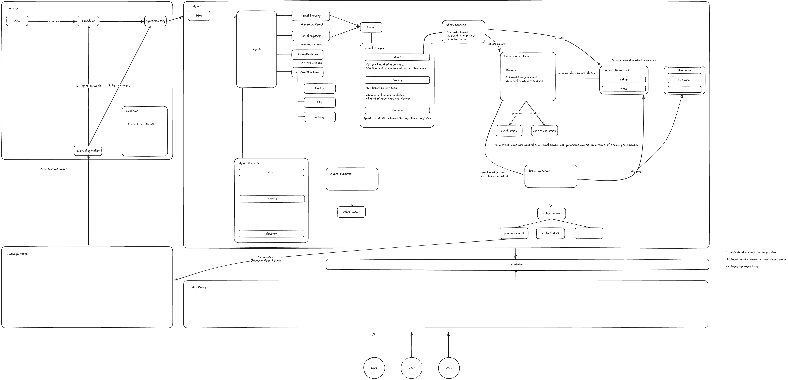
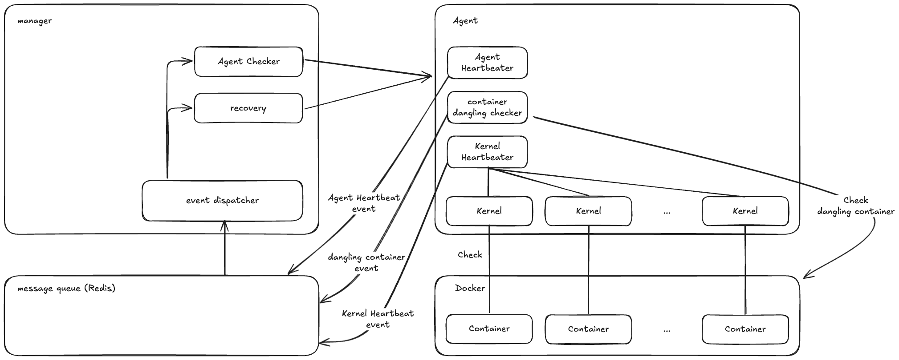

# Agent Architecture

## Abstract

This BEP (Backend.AI Enhancement Proposal) outlines an improved kernel management architecture for the Backend.AI Agent. It proposes a resource-centric new architecture to address current issues like inconsistent resource management, difficulties in state tracking, and compatibility problems caused by pickle-based recovery. The proposed architecture aims to structure resource lifecycle management, clarify state management, and provide enhanced error handling and recovery mechanisms.

## Motivation

The current Agent suffers from inconsistent operations across various components, leading to multiple issues. First, resource creation and cleanup often don't align. While we use Kernels to manage Containers, there are instances where consistent cleanup isn't guaranteed, and sometimes there's a missing 1:1 mapping between a Kernel and a Container.

Second, for retry logic, Kernel information is stored using **pickle**, which creates backward compatibility issues, making it difficult to fix the aforementioned problem easily.

Finally, state can be saved and updated at every layer, making it hard to track where and what values are being changed. For example, environment variables for container setup are updated by individual functions, and the context is continuously updated with values when creating a kernel, with a final update performed at the end. This leads to too much information being updated per function within the context, making it difficult to pinpoint the source of an issue when it arises.

Even if we were to fix current issues in isolation, without an architectural improvement of the Agent, we couldn't be certain that the problems are fully resolved. Therefore, it's essential to enhance the Agent's architecture.

## As-is


The current kernel creation flow broadly consists of the following steps:

1.  Create a **Context** for Kernel generation.
2.  Pull the Image.
3.  Allocate necessary resources for the kernel.
4.  Generate setup values for the container.
5.  Create the container.
6.  Check container and kernel operations.

However, the current kernel creation flow has the following problems:

1.  The **context** manages all state for kernel creation.
      * Since all state is managed within the context, it's hard to trace where problems occur.
      * Interdependent operations are all managed in the context, making code changes difficult.
2.  The resources required for kernel setup and their cleanup code aren't matched.
      * Container creation involves a function call at the time of creation, but cleanup code is called from an internal event loop.
3.  The Agent uses **pickle** for kernel recovery, which makes it difficult to modify the new version due to compatibility issues with older versions.
4.  The Agent and Kernel structures are too monolithic, making it hard to understand their operations.
5.  Resource dependencies required for kernel creation are intertwined, making them difficult to decipher.

## Suggested Architecture




The proposed architecture suggests managing resources by grouping related resources, rather than having a single integrated layer (the Agent) manage all resources. The Agent will only perform the flow of creating kernels and managing the created kernels.

For each created kernel, a **kernel runner** will be generated to manage the container and associated resources. When a kernel needs to be terminated, the associated async task of the kernel runner will be shut down, and all related resources will be cleaned up. This ensures that resources are structurally cleaned up when a kernel terminates.

### Kernel Creation

To manage resources within the Agent, resource management classes will inherit from `AbstractResource`. Resources to be allocated will be registered with the kernel when it's created. When the kernel terminates, all registered resources will be released. This guarantees structural resource cleanup upon kernel termination.

If a kernel's resource setup fails, the kernel will be terminated, and all resources registered with it will be released.

### Kernel Termination

When a kernel needs to be terminated, the Agent will shut down the **kernel runner** and release all resources registered with the kernel runner.

### Server Graceful Shutdown

Even if the Agent is shutting down, user containers should remain operational. In this scenario, the kernel runner will be canceled to prevent resource reclamation logic from executing.

In this case, the kernel runner terminates, but the resources registered with it are not all released. This can lead to a situation where containers are not cleaned up, resulting in **dangling resources**. To address this, when the next Agent starts, it will use **label information** from these dangling containers to send a **Dangling Container event** to the Manager. Since the Agent only knows local state and not the overall Backend.AI state, it sends the Dangling Container event to the Manager, which then performs recovery based on its overall Backend.AI restart logic.

### Server Abnormal Termination

If the Agent terminates abnormally, it cannot shut down the kernel runner, and resources registered with the kernel runner are not all released. Similar to a graceful shutdown, in this case, label information from the dangling containers will be used to send a **Dangling Container event** to the Manager.

### Container Abnormal Termination

If a container terminates abnormally, the kernel's normal operation cannot be guaranteed. Subsequently, the **Probing** feature can be used to check if the kernel is operating normally. If not, the kernel runner can be shut down, and all resources registered with it can be released.

However, in this current work, the kernel runner will not be shut down; instead, an event will be triggered to indicate the abnormal state of the container.

### Backward Compatibility



Modifying the current Agent's structure could lead to backward compatibility issues:

1.  How will we recover kernels running on older versions?
2.  If we roll back to an older version, how will newly created kernels be recovered?

> How will we recover kernels running on older versions?

In this architecture, to recover kernels from older versions, **Label information** stored in the container will be used to send a **Dangling Container event** to the Manager. Upon receiving this event, the Manager will create a **kernel wrapper** that uses the existing, running container as-is to recover the kernel. This approach allows for the recovery of kernels running on older versions, and new versions of kernels can be recovered using the same scenario.

> If we roll back to an older version, how will newly created kernels be recovered?

The current Agent structure faces a problem where **pickle** is used to recover kernels. If we consider a rollback, the new version would also need to use the same path for pickle files. In this work, we will add an implementation that uses a **flag** to disable pickle usage in both the Agent and Manager, allowing the Agent with this flag to be recovered by the Manager. Once stability is ensured, a **breaking change** will be introduced in older versions to transition to a structure that doesn't use pickle.

## Implementation Plan

### Resource Management

First, we propose the following interfaces for resource management:

```python
class Provisioner(ABC, Generic[TSpec, TResource]):
    """
    Base class for all provisioners in the stage.
    """

    @property
    @abstractmethod
    def name(self) -> str:
        """
        Returns the name of the provisioner.
        """
        raise NotImplementedError

    @abstractmethod
    async def setup(self, spec: TSpec) -> TResource:
        """
        Sets up the lifecycle stage.
        """
        raise NotImplementedError

    @abstractmethod
    async def teardown(self, resource: TResource) -> None:
        """
        Tears down the lifecycle stage.
        """
        raise NotImplementedError


class Stage(ABC, Generic[TSpec, TResource]):
    @abstractmethod
    def setup(self, spec_generator: SpecGenerator[TSpec]) -> None:
        """
        Sets up the lifecycle stage.
        """
        raise NotImplementedError

    @abstractmethod
    async def wait_for_resource(self) -> TResource:
        """
        Waits for the resource to be ready.
        """
        raise NotImplementedError
    
    @abstractmethod
    async def teardown(self) -> None:
        """
        Tears down the lifecycle stage.
        """
        raise NotImplementedError
```

We will implement a `Provisioner` for allocating resources and a `Stage` for managing resources. Dependencies for each resource will be injected as arguments,  minimizing internal state management within each class. This clarifies resource dependencies and allows for individual resource management.

A `Stage` will use a `Provisioner` to allocate resources and wait until the resources are ready. We can collect metrics on the preparation time and dangling status for each resource, and common processing can be handled within the `Stage`.

#### Example of Implementation

```python

class ProvisionStage(Stage[TSpec, TResource]):
    """
    A stage that provisions a resource.

    This stage is used to provision a resource using a provisioner.
    It waits for the spec to be ready and then uses the provisioner to set up the resource.
    """
    _provisioner: Provisioner
    _resource: Optional[TResource]
    _setup_completed: asyncio.Event
    _prometheus: Any

    def __init__(self, provisioner: Provisioner):
        self._provisioner = provisioner
        self._resource = None
        self._setup_completed = asyncio.Event()
    
    async def setup(self, spec_generator: SpecGenerator[TSpec]) -> None:
        """
        Sets up the lifecycle stage.
        """
        spec = await spec_generator.wait_for_spec()
        try:
            resource = await self._provisioner.setup(spec)
            self._resource = resource
        except Exception as e:
            log.error("Failed to setup resource: %s", e)
        finally:
            self._setup_completed.set()
    
    async def wait_for_resource(self) -> TResource:
        await self._setup_completed.wait()
        if self._resource is None:
            raise RuntimeError("Resource setup failed")
        return self._resource

    async def teardown(self) -> None:
        """
        Tears down the lifecycle stage.
        """
        if self._resource is None:
            return
        await self._provisioner.teardown(self._resource)
        self._resource = None
```

### Resource Registration

For structurally cleaning up resources upon kernel termination, we propose the following structure:

```python
class Runner:
    _resources: Sequence[AbstractResource]
    _closed_event: asyncio.Event

    def __init__(self, resources: Sequence[AbstractResource]):
        self._resources = resources
        self._closed_event = asyncio.Event()

    async def _setup(self) -> None:
        for resource in self._resources:
            try:
                await resource.setup()
            except Exception as e:
                raise

    async def _cleanup(self) -> None:
        for resource in self._resources:
            try:
                await resource.release()
            except Exception as e:
                ...

    async def start(self) -> None:
        """
        Start the runner.
        This will setup all resources and start runner loop.
        It will run until the runner is closed.
        """
        if self._closed_event.is_set():
            raise RuntimeError("Runner is already closed.")
        try:
            await self._setup()
        except Exception as e:
            await self._cleanup()
            raise
        asyncio.create_task(self._run())

    async def _run(self) -> None:
        try:
            await self._closed_event.wait()
        finally:
            await self._cleanup()

    async def close(self) -> None:
        """
        Close the runner.
        This will cleanup all resources.
        """
        self._closed_event.set()
```

The `Runner` implements a class that manages resources according to their lifecycle. Subsequently, we can implement observers to trigger events and probes to detect abnormal operations and attach them to the runner to terminate it.

## Plan

Applying this architecture requires the following steps:

### Phase 1: Add Test code for current agent

Write test code to test the behavior of the existing Agent's RPC call server. This phase ensures that the behavior of the existing Agent and the expected behavior of the modified Agent are identical, and that related side effects operate consistently.

### Phase 2: Add new Agent code

Write new Agent code based on the details described above. However, ensure that the newly written Agent code is activated via a **feature flag**.

### Phase 3: Remove old agent code

Once sufficient testing is complete, remove the old Agent code and the feature flag, allowing the new Agent code to operate.