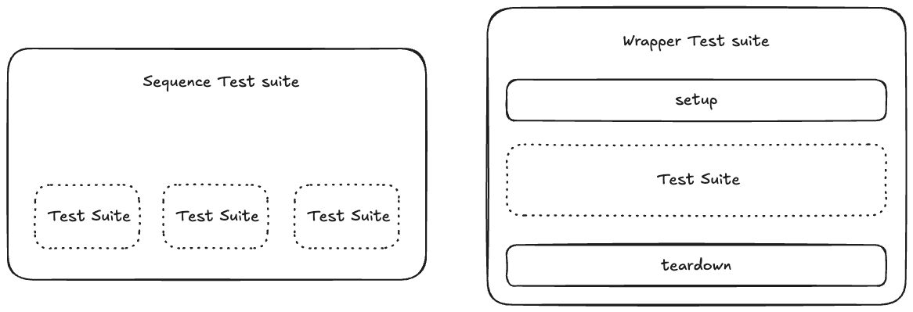

# Agent Architecture

## Abstract

The Backend.AI Tester is a component that automates real user scenarios to independently verify various features and behaviors of the system. Unlike traditional unit and integration tests, it simulates and validates issues that may arise in real environments, such as long-running sessions, resource cleanup, and complex interactions between components. The Tester operates as a separate service, defines and executes diverse test cases and scenarios, and systematically records and reports results, significantly enhancing the reliability and maintainability of Backend.AI.

## Motivation

As Backend.AI grows in scale and functionality, system complexity increases, making maintenance and verification more challenging. To address this, we propose introducing a new component called Tester. The Tester is responsible for testing various Backend.AI features and verifying system behavior, thereby improving stability and reliability, and helping developers better understand and maintain the system.

While unit and integration tests are currently in use, they are insufficient for testing real-world operations. For example, it is necessary to simulate and verify user actions to check if long-running sessions behave correctly, resources are properly cleaned up after multiple operations, and components interact as expected. The Tester provides the ability to automatically execute such scenarios and validate results, ensuring correct system behavior.

## Tester


The Tester is a separate component from the Backend.AI service, verifying operations by calling Backend.AI APIs. This allows independent testing of Backend.AI's behavior. The Tester defines various test cases, executes them, and validates the results.

The Tester consists of the following components:

## Tester Architecture


The Tester is composed of three main components:

1. **Test Spec**: Defines test scenarios. Each test case specifies certain actions and validates the results. The test spec maps scenario names to actions performed by the Tester, enabling execution of specific scenarios or groups.

2. **Test Runner**: Executes the test spec. It sequentially performs actions defined in the spec and validates results. The runner reads the spec, performs each action, and records results, which are delivered via an exporter for external reporting or logging.

3. **Test Case**: Defines individual test cases. Each case specifies actions and validates results. Test cases perform actions defined in the spec and validate outcomes, confirming system behavior.

### Test Suite

A Test Spec can include multiple test cases, allowing the definition of diverse scenarios. Each test case specifies actions and validates results. Test specs group cases to perform specific scenarios.

Some actions in test cases may be repeated. For example, session tests may repeatedly create, operate on, and terminate sessions. To support this, we introduce the Test Suite concept.



1. **Sequence Test Suite**: Executes test cases sequentially. Each case runs based on the previous result. If a step fails, subsequent tests are skipped, and failure information is recorded.

2. **Wrapper Test Suite**: Defines setup and teardown actions for test cases. Each case performs setup and teardown as defined, ensuring proper resource cleanup after completion.

## Test Spec Example

```python
class TestTag(enum.StrEnum):
    # component based tags
    MANAGER = "manager"
    AGENT = "agent"

    # Domain specific tags
    VFOLDER = "vfolder"
    IMAGE = "image"
    SESSION = "session"

@dataclass
class TestSpec:
    name: str
    description: str
    tags: set[TestTag]
    test_case: TestCase


class TestSpecManager:
    
    _specs: set[TestSpec]

    def __init__(self, specs: set[TestSpec]) -> None:
        self._specs = specs
    
    def all_specs(self) -> set[TestSpec]:
        """
        Get all test specifications.
        """
        return self._specs
    
    def specs_by_tag(self, tag: TestTag) -> set[TestSpec]:
        """
        Get test specifications by tag.
        """
        return {spec for spec in self._specs if tag in spec.tags}

    def specs_by_name(self, name: str) -> set[TestSpec]:
        """
        Get test specifications by name.
        """
        return {spec for spec in self._specs if spec.name == name}
```

TestSpec and TestSpecManager are implemented as above. TestSpecManager manages all test specs and provides functions to query by tag or name. Users can retrieve and execute desired specs through TestSpecManager.

## Tester Runner Example

```python
class TestExporter(ABC):
    async def export_done(self, spec: TestSpec) -> None:
        """
        Export the result of a test run.
        """
        raise NotImplementedError("Subclasses must implement this method.")

    async def export_exception(self, spec: TestSpec, exception: BaseException) -> None:
        """
        Export the exception that occurred during the test run.
        """
        raise NotImplementedError("Subclasses must implement this method.")
    

class TestRunner:
    _spec: TestSpec
    _exporter: TestExporter

    def __init__(self, spec: TestSpec, exporter: TestExporter) -> None:
        self._spec = spec
        self._exporter = exporter
    
    async def run(self) -> None:
        try:
            await self._spec.test_case.run_test()
            await self._exporter.export_done(self._spec)
        except BaseException as e:
            await self._exporter.export_exception(self._spec, e)

_DEFAULT_CONCURRENCY = 10

class Tester:
    _spec_manager: TestSpecManager
    _exporter: TestExporter
    _semaphore: asyncio.Semaphore

    def __init__(self, spec_manager: TestSpecManager, exporter: TestExporter) -> None:
        self._spec_manager = spec_manager
        self._exporter = exporter
        self._semaphore = asyncio.Semaphore(_DEFAULT_CONCURRENCY)
    
    async def _run_spec(self, spec: TestSpec) -> None:
        """
        Run a single test specification.
        """
        async with self._semaphore:
            print(f"Running test: {spec.name}")
            runner = TestRunner(spec, self._exporter)
            await runner.run()
            print(f"Finished test: {spec.name}")
        
    async def run_all(self) -> None:
        """
        Run all test specifications.
        """
        for spec in self._spec_manager.all_specs():
            asyncio.create_task(self._run_spec(spec))

    async def run_by_tag(self, tag: TestTag) -> None:
        """
        Run test specifications by tag.
        """
        for spec in self._spec_manager.specs_by_tag(tag):
            asyncio.create_task(self._run_spec(spec))

        
    async def run_by_name(self, name: str) -> None:
        """
        Run test specifications by name.
        """
        for spec in self._spec_manager.specs_by_name(name):
            asyncio.create_task(self._run_spec(spec))
```

TestRunner and Tester are implemented as above. TestRunner executes a single test spec and delivers results via the exporter. Tester executes multiple specs with limited concurrency, efficiently running and recording results.
