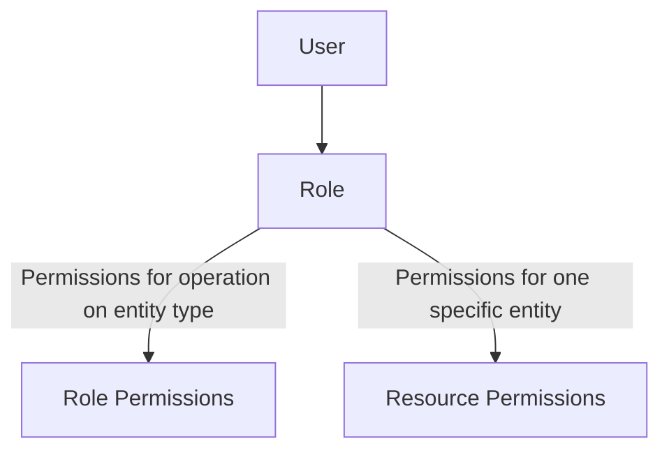

# Backend.AI Role-Based Access Control (RBAC)

## Abstract

This BEP (Backend.AI Enhancement Proposal) introduces the Role-Based Access Control (RBAC) system for Backend.AI. This system enables granular permission management for users and projects, providing flexible access control suitable for various use cases. RBAC defines API access permissions according to user roles, thereby enhancing security and management efficiency.

## Motivation

Backend.AI allows multiple users to perform various operations on different entities such as sessions, vfolders, and images, with limited permissions granted through user or project privileges. However, the current authentication and permission management system provides fragmented permissions for specific domain tasks and lacks granular permission management, making it difficult to set detailed permissions. Additionally, inconsistent permission management for users and projects does not guarantee consistent behavior at the time of permission verification.

To address these issues, Backend.AI aims to introduce a Role-Based Access Control (RBAC) system. The RBAC system defines permissions for various entities and operations throughout the system according to user roles and manages permissions in a generalized manner. This enables granular permission settings and consistent permission management. Furthermore, the RBAC system ensures consistent permission verification for all requests, enhancing security and management efficiency.

## Design

### Permission Architecture



Users can have one or more Roles, and each Role has multiple Permissions. Previously, each permission was assigned and managed directly to users, but this made the relationship between users and permissions complex and difficult to manage. Therefore, Roles were introduced to group permissions, and users are granted permissions through Roles. This structure improves consistency in permission management and simplifies the relationship between users and permissions.

Permissions are divided into 4 main types:
1. **Role Permissions**: Defines permissions for operations on a specific Entity Type.
2. **Resource Permissions**: Defines permissions for operations on a specific Entity.
3. **Grantable Role Permissions**: Defines permissions to grant specific Role Permissions to another user's Role. For example, the permission to grant 'create', 'read', 'update', 'delete' permissions for the 'session' Entity Type to another Role. A Role with this permission can grant Role Permissions to other Roles.
4. **Grantable Resource Permissions**: Defines permissions to grant specific Resource Permissions to another user's Role. For example, the permission to grant 'read', 'update' permissions for a specific 'session' Entity to another Role. A Role with this permission can grant Resource Permissions to other Roles.

#### Role Permissions

Role Permissions define permissions for operations on a specific Entity Type. For example, operations such as 'create', 'read', 'update', 'delete' can be defined for the 'session' Entity Type. A Role granted this permission can perform operations on all Entities of the Entity Type accessible within a specific scope.

This is a permission type for batch permission management. When roles such as an Admin solely for Session management or an Admin solely for managing Resource groups are needed within a team, the desired scope and Entity Type permissions can be defined as Role Permissions.

#### Resource Permissions

Resource Permissions define permissions for operations on a specific Entity. For example, operations such as 'read', 'update', 'delete' can be defined for a specific 'session' Entity. A Role granted this permission can perform operations only on that Entity. Unlike Role Permissions, Resource Permissions define permissions for specific Entities. Therefore, Resource Permissions enable more granular permission management than Role Permissions.

This is a permission type for managing permissions by specific Entity, allowing granular permission management such as granting only 'read' permission for a specific Session, or granting 'read' and 'update' permissions for a specific VFolder to enable collaboration with other users.

#### Grantable Role Permissions

Grantable Role Permissions define permissions to grant specific Role Permissions to another user's Role. A Role with this permission can grant Role Permissions to other Roles. For example, it's the permission to grant 'create', 'read', 'update', 'delete' permissions for the 'session' Entity Type to another Role. This permission enables delegation of permissions between Roles.

Permissions for granting Role Permission are managed separately from Role Permissions because the required permissions almost correspond one-to-one with Role Permissions. However, if permissions for granting Grantable Role Permissions were to be separated, it would require recursively additional tables, so permissions for granting Grantable Role Permissions are managed by granting 'grant' permission within Grantable Role Permissions. For example, the permission to grant permissions for the 'session' Entity Type to another Role is managed by granting 'grant' permission within the 'grantable_session_permissions' table. This structure clarifies permission delegation and simplifies the relationship between Roles. The 'grant' permission does not grant granular permissions by operations such as 'read', 'update', 'delete', but only grants the permission to grant Role Permissions for a specific Entity Type.

#### Grantable Resource Permissions

Grantable Resource Permissions define permissions to grant specific Resource Permissions to another user's Role. A Role with this permission can grant Resource Permissions to other Roles. For example, it's the permission to grant 'read', 'update' permissions for a specific 'session' Entity to another Role. This permission enables the granting of permissions for specific Resources.

Like Grantable Role Permissions, Grantable Resource Permissions are also managed in a form where a user granted with 'grant' permission can grant the above permissions. For example, the permission to grant 'read', 'update' permissions for a specific 'session' Entity to another Role is managed by granting 'grant' permission within the 'grantable_session_resource_permissions' table.

### Flow

#### RBAC check Flow

1. A user requests an operation by calling a specific REST API or GraphQL.
2. All requests verify permissions in the Action Processor.
3. The permissions for the requested Action and Entity are verified.
   1. If there are Role Permissions, the Operations defined in those Role Permissions are verified.
   2. If there are Resource Permissions, the Resource Permissions for that Entity ID are verified.
4. If permissions exist, the request is processed; otherwise, an appropriate error message is returned.

#### Grant Flow

1. A user requests a Grant operation by calling a specific REST API or GraphQL.
2. The Action Processor verifies whether the Grant request can be performed.
3. It checks whether the requested permission can be granted.
   1. If granting Role Permissions, it checks if the corresponding Grantable Role Permissions exist.
   2. If granting Resource Permissions, it checks if both Grantable Role Permissions and Grantable Resource Permissions exist.
4. If permissions exist, the Permission is granted; otherwise, an appropriate error message is returned.

### Database Schema

The RBAC system of Backend.AI is implemented by extending the existing database structure. New RBAC tables are integrated with the existing scope-based permission system.

#### Core RBAC Tables

##### 1. roles table

```sql
CREATE TABLE roles (
    id UUID PRIMARY KEY DEFAULT gen_random_uuid(),
    name VARCHAR(64) NOT NULL,
    description TEXT,
    is_active BOOLEAN DEFAULT TRUE,
    created_at TIMESTAMP WITH TIME ZONE DEFAULT NOW(),
    updated_at TIMESTAMP WITH TIME ZONE DEFAULT NOW(),
    UNIQUE(name, scope_type, scope_id)
);
```

The roles table defines sets of Permissions within the system. Each Role includes a name, description, activation status, etc. This table itself does not actually grant permissions, but connects with other tables to manage permissions. The `id` value of the `roles` table is used as the `role_id` in each permissions table, defining the relationship between Roles and Permissions.

##### 2. user_roles table
```sql
CREATE TABLE user_roles (
    id UUID PRIMARY KEY DEFAULT gen_random_uuid(),
    user_id UUID NOT NULL REFERENCES users(uuid) ON DELETE CASCADE,
    role_id UUID NOT NULL REFERENCES roles(id) ON DELETE CASCADE,
    granted_by UUID REFERENCES users(uuid),
    granted_at TIMESTAMP WITH TIME ZONE DEFAULT NOW(),
    UNIQUE(user_id, role_id)
);
```

The user_roles table defines the relationship between each user and Role. Users can have multiple Roles, and each Role receives permissions through associations with specific permissions tables. Users granted permissions can record who granted the permission through the `granted_by` field.

##### 3. role_permissions table (Role Permissions)
```sql
CREATE TABLE role_permissions (
    id UUID PRIMARY KEY DEFAULT gen_random_uuid(),
    role_id UUID NOT NULL REFERENCES roles(id) ON DELETE CASCADE,
    entity_type VARCHAR(32) NOT NULL, -- 'session', 'vfolder', 'image', etc.
    operation VARCHAR(32) NOT NULL,   -- 'create', 'read', 'update', 'delete', etc.
    scope_type VARCHAR(32),           -- 'system', 'domain', 'project', 'user'
    scope_id VARCHAR(64),             -- Specific scope identifier
    created_at TIMESTAMP WITH TIME ZONE DEFAULT NOW(),
    granted_by UUID REFERENCES users(uuid),
    granted_at TIMESTAMP WITH TIME ZONE DEFAULT NOW(),
    expires_at TIMESTAMP WITH TIME ZONE,
    UNIQUE(role_id, entity_type, operation, scope_type, scope_id)
);
```

The role_permissions table defines Operations that a Role can perform on specific Entity Types. This table grants permissions for entity_type and operation to a specific Role. For example, operations such as 'create', 'read', 'update', 'delete' can be defined for the 'session' Entity Type. A Role with this permission can perform operations on all Entities of the Entity Type within a defined scope.

##### 4. resource_permissions table (Resource Permissions)
```sql
CREATE TABLE resource_permissions (
    id UUID PRIMARY KEY DEFAULT gen_random_uuid(),
    role_id UUID NOT NULL REFERENCES roles(id) ON DELETE CASCADE,
    entity_type VARCHAR(32) NOT NULL, -- 'session', 'vfolder', 'image', etc.
    entity_id UUID NOT NULL,          -- Specific entity ID
    operation VARCHAR(32) NOT NULL,   -- 'read', 'update', 'delete', 'execute', etc.
    created_at TIMESTAMP WITH TIME ZONE DEFAULT NOW(),
    granted_by UUID REFERENCES users(uuid),
    granted_at TIMESTAMP WITH TIME ZONE DEFAULT NOW(),
    expires_at TIMESTAMP WITH TIME ZONE,
    UNIQUE(role_id, entity_type, entity_id, operation)
);
```

The resource_permissions table defines Operations that a Role can perform on specific Entities. This table grants permissions for entity_type and entity_id to a specific Role. For example, operations such as 'read', 'update', 'delete' can be defined for a specific 'session' Entity. A Role with this permission can perform operations only on that Entity.

##### 5. grantable_role_permissions table (Grantable Role Permissions)
```sql
CREATE TABLE grantable_role_permissions (
    id UUID PRIMARY KEY DEFAULT gen_random_uuid(),
    role_id UUID NOT NULL REFERENCES roles(id) ON DELETE CASCADE,
    entity_type VARCHAR(32) NOT NULL,
    operation VARCHAR(32) NOT NULL, -- 'create', 'read', 'update', 'delete', 'grant', etc.
    scope_type VARCHAR(32),
    scope_id VARCHAR(64),
    created_at TIMESTAMP WITH TIME ZONE DEFAULT NOW(),
    granted_by UUID REFERENCES users(uuid),
    granted_at TIMESTAMP WITH TIME ZONE DEFAULT NOW(),
    expires_at TIMESTAMP WITH TIME ZONE,
    UNIQUE(role_id, entity_type, operation, scope_type, scope_id)
);
```

The grantable_role_permissions table defines permissions to grant specific Role Permissions to another Role. This table defines permissions to grant permissions for entity_type and operation to a specific Role. For example, it's the permission to grant 'create', 'read', 'update', 'delete' permissions for the 'session' Entity Type to another Role. A Role with this permission can grant Role Permissions to other Roles.

##### 6. grantable_resource_permissions table (Grantable Resource Permissions)
```sql
CREATE TABLE grantable_resource_permissions (
    id UUID PRIMARY KEY DEFAULT gen_random_uuid(),
    role_id UUID NOT NULL REFERENCES roles(id) ON DELETE CASCADE,
    entity_type VARCHAR(32) NOT NULL,
    entity_id UUID NOT NULL,
    operation VARCHAR(32) NOT NULL, -- 'create', 'read', 'update', 'delete', 'grant', etc.
    created_at TIMESTAMP WITH TIME ZONE DEFAULT NOW(),
    granted_by UUID REFERENCES users(uuid),
    granted_at TIMESTAMP WITH TIME ZONE DEFAULT NOW(),
    expires_at TIMESTAMP WITH TIME ZONE,
    UNIQUE(role_id, entity_type, entity_id, operation)
);
```

The grantable_resource_permissions table defines permissions to grant specific Resource Permissions to another Role. This table defines permissions to grant permissions for entity_type and entity_id to a specific Role. For example, it's the permission to grant 'read', 'update' permissions for a specific 'session' Entity to another Role. A Role with this permission can grant Resource Permissions to other Roles.

#### Migration from Existing Tables (Example: VFolder Invitation)

Currently, Backend.AI has the VFolder Invitation feature, which operates by granting permissions for VFolders to specific users. For migration to the new RBAC system, the existing VFolder Invitation feature can be modified to fit the new RBAC structure.

1. **Existing VFolder Invitation Table**:
   - Currently, VFolder Invitation operates by granting permissions for VFolders to specific users.
   - This feature is managed in the `vfolder_invitations` table.

2. **Migration to the New RBAC System**:
    - Convert the `vfolder_invitations` table to the `resource_permissions` table of the new RBAC system.
    - Each VFolder Invitation is added as a new record to the `resource_permissions` table.
    - Set the `entity_type` field to 'vfolder' and the `entity_id` field to the ID of the corresponding VFolder.
    - Set the `operation` field to permissions such as 'read', 'update'.

3. **Change in Existing Permission Check**:
   - Remove the permission verification logic from the existing VFolder Invitation feature.
   - Instead, use the permission verification logic of the new RBAC system to check permissions in the Service Layer of VFolder.

## Conclusion

The RBAC system of Backend.AI enables granular permission management for users and projects, providing flexible access control suitable for various use cases. This system manages permissions based on Roles and allows granular permission settings through Role Permissions and Resource Permissions. Permission delegation between Roles is possible through Grantable Role Permissions and Grantable Resource Permissions, thereby enhancing management efficiency. The RBAC system ensures consistent permission verification for all requests, enhancing security and management efficiency.
