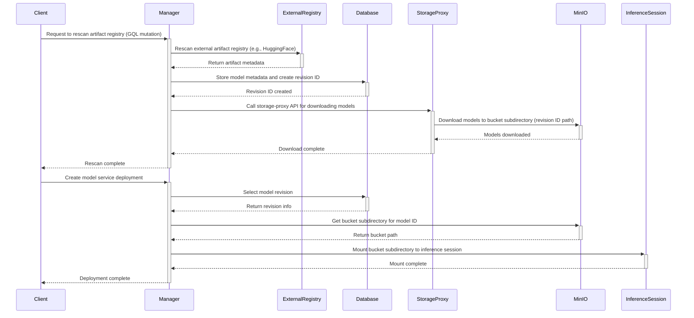
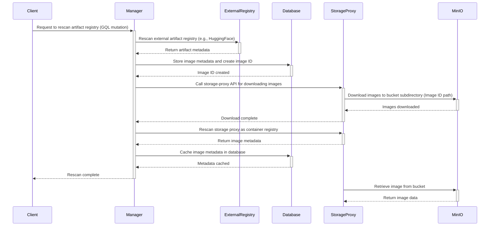

# Support MinIO as Artifact Registry Storage Backend

Let's add support for `MinIO` in the storage proxy as a storage backend for the artifact registry.

## Motivation

To include the currently external *Reservoir* service into the Backend.AI core, an internal storage system capable of storing all kinds of artifacts including models and images must be integrated.

# Use Cases

Depending on the type of model artifact, the following use cases can be considered:

## Use Case in Model Service

For model artifacts, the following usage scenarios can be considered:

1. Client sends a request to the manager to rescan the artifact registry via a GQL mutation.

2. Manager rescans an external artifact registry (such as HuggingFace or an external manager), and the metadata of the models is stored in the database.

3. Call storage-proxy API for downloading the rescanned models to the storage.

4. The models and metadata files are downloaded to the subdirectory path corresponding to the revision ID of the bucket.

5. When creating a model service deployment, the subdirectory of the bucket corresponding to the model ID specified in the selected revision is mounted to the inference session at the point when the service scales out.



## Use Case in Image Service

For model artifacts, the following usage scenarios can be considered:

1. Client sends a request to the manager to rescan the artifact registry via a GQL mutation.

2. Manager rescans an external artifact registry (such as HuggingFace or an external manager), and the metadata of the models is stored in the database.

3. Call storage-proxy API for downloading the rescanned images to the storage.

4. The images are downloaded to the subdirectory path corresponding to the revision ID of the bucket.

5. Manager caches the image metadata in the database by rescanning the storage proxy as a container registry. (*Requirements: Implement Harbor registry API specification in the storage proxy to enable it to function as a container registry*)



## Use Case in Package Service

TBW: For now, we are not considering the Package service as a priority.

# Database Schema

## Artifact Registry Storage Mapping Table

The artifact registry requires database tables to store mapping information between artifacts and MinIO bucket paths.

```sql
CREATE TABLE artifact_registry (
    id UUID PRIMARY KEY DEFAULT gen_random_uuid(),
    name VARCHAR(63) NOT NULL,
    storage_backend VARCHAR(50) NOT NULL DEFAULT 'minio',  -- 'minio', 's3', etc.
);

-- MinIO storage specific
CREATE TABLE artifact_registry_minio (
    id UUID PRIMARY KEY DEFAULT gen_random_uuid(),
    registry_id  UUID NOT NULL,  -- Create an ORM relationship instead of a foreign key constraint.
    bucket_name VARCHAR(63) NOT NULL,
    bucket_path TEXT NOT NULL,
);
```

# Storage Proxy Implementations

The following additional implementations are required to realize the use cases.

## Integration with MinIO

Add service code to the storage proxy for configuring the artifact registry.
We can refer to components such as `BaseVolume` and `FsOpModel`, which operate as the VFolder backend, when writing the implementation. But, since the artifact registry storage does not need to function as a VFolder at this point, let's remove any unnecessary parts and properly abstract the interface.

Communication with `MinIO` is handled using `s3fs`. We will need to implement an `FsOpModel` that mounts the `s3fs` bucket as a file system on the storage host and handles download and upload operations.

## API Specifications

It will be necessary to implement additional CRUD REST APIs for each artifact type in the storage proxy.

### Artifact Registry APIs

The artifact registry APIs will be structured to handle artifact-specific operations:

#### Download Artifacts from External Registry
```
POST /artifact-registry/download
Content-Type: application/json

{
  "registry_type": "huggingface",
  "registry_url": "https://huggingface.co/models/gpt-2",
  "revision_id": "abc123def456",
  "artifact_type": "model",
  "credentials": {
    "token": "hf_token_here"
  }
}

Response:
{
  "task_id": "download_task_123",
  "status": "started",
  "message": "Download started for artifact gpt-2"
}
```

#### Get Download Task Status
```
GET /artifact-registry/download/{task_id}

Response:
{
  "task_id": "download_task_123",
  "status": "completed",
  "progress": 100,
  "artifact_path": "models/gpt-2/abc123def456",
  "downloaded_files": [
    "config.json",
    "pytorch_model.bin",
    "tokenizer.json"
  ]
}
```

#### Get Artifact Mount Path
```
GET /artifact-registry/mount
Content-Type: application/json

{
  "revision_id": "abc123def456",
  "artifact_type": "model",
  "subpath": "models/gpt-2/abc123def456"
}

Response:
{
  "mount_path": "/var/lib/backend.ai/storage/artifact-registry/models/gpt-2/abc123def456"
}
```

#### List Artifacts in Registry
```
POST /artifact-registry/list
Content-Type: application/json

{
  "artifact_type": "model",
  "revision_id": "abc123def456"
}

Response:
{
  "artifacts": [
    {
      "revision_id": "abc123def456",
      "artifact_type": "model",
      "artifact_path": "models/gpt-2/abc123def456",
      "size": 548000000,
      "files": [
        {
          "name": "config.json",
          "size": 1024,
          "last_modified": "2025-07-11T10:00:00Z"
        },
        {
          "name": "pytorch_model.bin",
          "size": 547998976,
          "last_modified": "2025-07-11T10:05:00Z"
        }
      ]
    }
  ]
}
```

#### Delete Artifact
```
DELETE /artifact-registry/{artifact_id}
Content-Type: application/json

{
  "artifact_type": "model"
}

Response: 204 No Content
```

#### Create File Download Session
```
POST /artifact-registry/file/download
Content-Type: application/json

{
  "revision_id": "abc123def456",
  "artifact_type": "model",
  "file_path": "models/gpt-2/abc123def456/pytorch_model.bin"
}

Response:
{
  "token": "jwt-token-for-download-session"
}
```

## Config format

```toml
[artifact_registry.storage]

[artifact_registry.storage.minio1]
backend = "minio"
endpoint = "https://minio.example.com"

[artifact_registry.storage.minio1.options]
minio-access-key = "your-access-key"
minio-secret-key = "your-secret-key"
```

# Reference

- [`s3fs` FAQ](https://github.com/s3fs-fuse/s3fs-fuse/wiki/FAQ)

- [`s3fs` options](https://github.com/s3fs-fuse/s3fs-fuse/wiki/Fuse-Over-Amazon#options)
