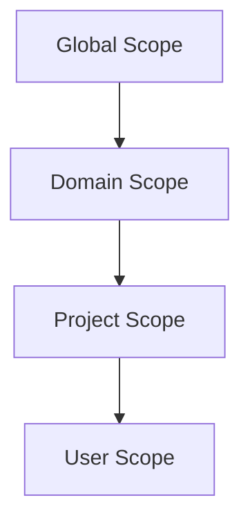

# Backend.AI Role-Based Access Control (RBAC) Feature Specification

## Abstract

This document defines the functional requirements for Backend.AI's Role-Based Access Control (RBAC) system. The RBAC system aims to provide a unified and consistent permission management framework across all entity types in Backend.AI, replacing the current fragmented permission logic. This specification focuses on defining the features and behaviors of the RBAC system, while the technical implementation details are covered in BEP-1008.

## Motivation

The current Backend.AI permission system has several critical limitations that make it difficult to maintain and extend:

1. **Fragmented and Inconsistent Permission Logic**: Each entity type (Compute Session, VFolder, Image, Model Service, etc.) implements its own permission checking logic. Developers must examine the code for each entity to understand how permissions work. Permission handling varies significantly across entity types, leading to different permission models for similar operations, inconsistent behavior across the system, and high maintenance burden when adding new features.

2. **Limited Granularity**: The current system provides only basic user roles (superadmin, user) without flexible permission assignment capabilities.

3. **Poor Scalability**: As new entity types are added, each requires custom permission logic, increasing system complexity exponentially.

4. **Inconsistent Collaboration Support**: While some entity types like VFolder have invitation-based sharing mechanisms, other entity types (e.g., Compute Sessions, Model Services) lack systematic ways to share resources with specific permissions. This inconsistency makes it difficult for users to collaborate effectively across different resource types.

To address these issues, Backend.AI will adopt a unified RBAC system that provides:
- Consistent permission model across all entity types
- Flexible role definition and assignment
- Granular permission control at both type and resource levels
- Better support for collaborative workflows

## Current Design (As-is)

### Existing User Roles

Backend.AI currently supports two user roles:
- **superadmin**: Global administrator with full system access
- **user**: Regular user with limited permissions

### Current Permission Model

Each entity type in Backend.AI implements its own permission checking logic:

- **Compute Sessions**: Permission checks are scattered throughout session management code
- **VFolders**: Uses a separate invitation system for sharing with custom permission logic
- **Images**: Permission checks based on user ownership and visibility settings
- **Model Services**: Service-specific permission validation
- **Domains and Projects**: Hierarchical ownership model with implicit permissions

### Problems

1. **Code-Level Permission Logic**: Permissions are embedded in application code rather than being data-driven, requiring code changes for permission modifications.

2. **No Unified Interface**: Each entity type has different methods for checking permissions, making it difficult to:
   - Understand the overall permission structure
   - Audit permissions across the system
   - Implement consistent permission checking

3. **Limited Delegation**: No systematic way to delegate permissions to other users except for specific features like VFolder invitations.

4. **Maintenance Burden**: Changes to permission logic require understanding entity-specific implementations, increasing development time and error risk.

## Proposed Design (To-be)

### Entity Types

The RBAC system will manage permissions for the following entity types:

| Entity Type | Description | Dual Role |
|-------------|-------------|-----------|
| Compute Session | Computational workloads and containers | Entity only |
| VFolder | Virtual folders for data storage | Entity only |
| Image | Container images for sessions | Entity only |
| Model Service | Model serving deployments | Entity only |
| Domain | Administrative domain grouping | Entity & Scope |
| Project | Project grouping within domains | Entity & Scope |
| User | User accounts | Entity & Scope |
| Role | Permission set definitions | Entity only |
| Role Assignment | User-role mappings within specific scopes | Entity only |

**Note**: Domain, Project, and User serve dual roles as both manageable entities and permission scopes. Role defines what permissions are available, while Role Assignment maps users to roles within specific scopes.

### Operations

All entity types support the same set of operations, providing consistency across the system:

| Operation | Description |
|-----------|-------------|
| **create** | Create new entities of this type |
| **read** | View entity information and metadata |
| **update** | Modify entity properties and settings |
| **soft-delete** | Mark entity as deleted without removing data |
| **hard-delete** | Permanently remove entity data |

**Note on delete operations for Role and Role Assignment**:
Role and Role Assignment entities support soft-delete and hard-delete operations in the initial implementation. Soft-delete preserves the entity in an inactive state for audit purposes and allows reactivation, while hard-delete permanently removes the entity from active use (database records may be retained for audit trails).

**Note on Role Assignment operations**:
- **create**: Assign a role to a user within a specific scope (requires `create` permission for `role_assignment` entity type)
- **read**: View existing Role Assignments (requires `read` permission for `role_assignment` entity type)
- **update**: Modify Role Assignment metadata such as expiration time or state (requires `update` permission for `role_assignment` entity type)

To manage Role Assignments within a scope, users need the corresponding permissions for the `role_assignment` entity type. For example, a Project Admin needs `create` and `update` permissions for `role_assignment` to assign and manage roles for project members.

#### Soft-Delete vs Hard-Delete

- **soft-delete**: Changes the entity's state in the database without removing underlying data
  - Example: Moving a VFolder to trash (files remain intact)
  - For Role: Marks as inactive, preventing new Role Assignments but retaining existing ones
  - For Role Assignment: Changes state to inactive, suspending permissions but preserving the assignment record
  - Allows recovery and maintains referential integrity
  - Soft-deleted entities can be reactivated by authorized administrators

- **hard-delete**: Removes the actual data associated with the entity
  - Example: Permanently deleting files in a trashed VFolder
  - For Role: Removes the role definition (only allowed if no active Role Assignments reference it)
  - For Role Assignment: Permanently removes the assignment record
  - Note: Database records may be retained for audit purposes

### Permission Delegation

In the RBAC system, permission delegation is achieved through Role and Role Assignment management, eliminating the need for special "grant" operations.

**How Permission Delegation Works**:
1. Create or identify a Role with the desired permissions
2. Create a Role Assignment linking the target user to that Role
3. The user immediately receives all permissions defined in the Role

**Example**: To give User B read access to a VFolder:
1. Create a Role with Object Permission for that VFolder (or use existing Role)
2. Create a Role Assignment: User B → VFolder Reader Role
3. User B can now read the VFolder

**Scope Rules**:
- Each Role is bound to a single scope at creation time
- Role Assignments can only be created by users with `create` permission for `role_assignment` entity type within that scope
- Scope admins manage roles and assignments within their own scope only
- Cross-scope sharing is enabled through Object Permissions, not through hierarchical delegation

**Security Constraints**:

To prevent privilege escalation, the RBAC system enforces strict constraints on Role Assignment creation:

1. **Role Read Permission Required**: Creating a Role Assignment requires `read` permission for the target Role
   - Users can only assign Roles they have permission to view
   - This ensures users cannot blindly assign arbitrary Roles

2. **Scope-Based Access Control**: Role read permissions are scope-bound
   - Project Admin with `role:read` in Project-A scope can only read Roles bound to Project-A
   - Project Admin cannot read Global-scope Roles or Roles from other projects
   - This prevents Project Admins from assigning Global Admin or other cross-scope Roles

3. **Combined Protection**: These two mechanisms together prevent privilege escalation
   - Even if a Project Admin has `role_assignment:create` permission
   - They cannot assign Global Admin role because:
     - They lack `role:read` permission in Global scope
     - They cannot discover or reference Global-scope Roles

**Example - Why Project Admin Cannot Escalate**:
```
Project Admin (Project-A scope) has:
- Permissions: role:read, role:create, role_assignment:create (all in Project-A scope)

Attempting to assign Global Admin role:
1. Project Admin tries to create Role Assignment: User X → Global Admin
2. System checks: Does Project Admin have `role:read` for Global Admin?
3. Global Admin is bound to Global scope
4. Project Admin only has `role:read` in Project-A scope
5. ❌ Permission denied - Cannot read Global Admin role
6. ❌ Cannot create Role Assignment
```

### Permission Types

The RBAC system provides two types of permissions:

#### 1. Permission (Type-Level Permission)

Defines permissions for operations on an **entity type** within a specific scope.

- Specifies: entity type (e.g., `vfolder`) + operation (e.g., `read`)
- Applies to all entities of that type accessible within the scope
- Example: `vfolder:read` permission allows reading all VFolders within the scope
- Grouped within a Role's Permission Group, which is bound to a single scope

#### 2. Object Permission (Instance-Level Permission)

Defines permissions for operations on a **specific entity instance**.

- Specifies: entity type + entity ID + operation
- Applies only to that specific entity
- Example: `vfolder:{id}:read` permission allows reading only that specific VFolder
- Can reference entities from different scopes, enabling cross-scope sharing
- Attached directly to a Role, independent of the Role's scope binding

**Cross-Scope Object Permissions**:
A Role bound to Project-A scope can include Object Permissions for entities in Project-B scope. This enables scenarios like:
- Sharing a personal VFolder with project team members
- Granting access to a specific session across projects
- Collaborative workflows spanning multiple scopes

### Role Structure

Each Role in the RBAC system has the following structure:

**Core Attributes**:
- **Name**: Human-readable role name (e.g., "Project-A-Admin", "VFolder-X-Reader")
- **Description**: Optional description of the role's purpose
- **Scope Binding**: Every Role is bound to exactly one scope (Global, Domain, Project, or User)
- **Source**: Indicates whether the role is system-generated or custom-created

**Permission Components**:
- **Permissions**: A collection of type-level permissions (entity type + operation) that apply within the Role's bound scope
  - Internally grouped in a "Permission Group" representing the scope
  - Example: `vfolder:read`, `compute_session:create`
- **Object Permissions**: A collection of instance-level permissions (entity type + entity ID + operation)
  - Can reference entities from any scope, enabling cross-scope sharing
  - Example: `vfolder:abc-123:read`

**Note**: The "Permission Group" is an internal structure that associates Permissions with the Role's scope. From a user perspective, a Role simply has a scope and a list of permissions.

### Role Source

Roles in the RBAC system have a source attribute indicating how they were created:

| Role Source | Description | Management |
|-------------|-------------|------------|
| **system** | Automatically created by the system | Created when scopes are created; cannot be deleted |
| **custom** | Manually created by administrators | Can be created, modified, and deleted by users with appropriate permissions |

#### System Roles

When a new scope (Domain, Project, or User) is created, the system automatically creates an admin role for that scope:

- **Domain creation** → Domain Admin role (system sourced, bound to that domain scope)
- **Project creation** → Project Admin role (system sourced, bound to that project scope)
- **User creation** → User Owner role (system sourced, bound to that user scope)

System roles ensure that every scope has at least one administrator capable of managing resources within that scope.

### Role Assignment Entity

Role Assignment is a separate entity that maps users to roles within specific scopes. This design provides several benefits:

**Key Characteristics**:
- **Separation of Concerns**: Role definition is independent of Role Assignment
- **Flexible Management**: Create and manage Role Assignments without modifying the Role itself
- **Audit Trail**: Each assignment tracks who granted it and when
- **Consistent Operations**: Uses standard create/read/update operations instead of special-purpose operations

**Role Assignment Attributes**:
- `user_id`: The user receiving the role
- `role_id`: The role being assigned
- `scope_type` and `scope_id`: Where the role applies
- `granted_by`: Who created this assignment
- `granted_at`: When the assignment was created
- `state`: Active or inactive

**Example**:
- Role: "Project-A-User" (defines permissions for Project A)
- Role Assignment: User Alice → "Project-A-User" role
- Result: Alice has the permissions defined in "Project-A-User" role within Project A scope

**Role Assignment Management**:

Role Assignments can be managed by users with appropriate permissions within the scope:

- **Create**: Users with `role_assignment:create` permission in the scope can create new Role Assignments
- **Read**: Users with `role_assignment:read` permission can view Role Assignments within the scope
- **Update**: Users with `role_assignment:update` permission can modify Role Assignment metadata (e.g., change state from inactive to active, update expiration time)
- **Delete**: Users with `role_assignment:soft-delete` or `role_assignment:hard-delete` permissions can remove Role Assignments

**Scope Administrators**: Users assigned to admin roles for a scope (e.g., Domain Admin, Project Admin) typically have all Role Assignment management permissions for that scope, allowing them to:
- Assign roles to users within their scope
- Revoke role assignments by soft-deleting or deactivating them
- Reactivate soft-deleted or inactive Role Assignments
- View all role assignments within their scope

### Scope Hierarchy

Backend.AI uses a four-level scope hierarchy:



**Scope Characteristics**:
- **Global Scope**: System-wide resources and permissions
- **Domain Scope**: Organizational units within the system
- **Project Scope**: Collaborative workspaces within domains
- **User Scope**: Individual user's private resources

**Management Principle**:
Each scope is managed independently by its respective administrators:
- **Global Admin**: Manages global scope resources
- **Domain Admin**: Manages their domain scope resources
- **Project Admin**: Manages their project scope resources
- **User Owner**: Manages their user scope resources

**Important: No Permission Inheritance**:
Permissions defined in a Role bound to a specific scope apply **only** to actions within that scope. They do **not** cascade to child scopes.

Examples:
- A Domain Admin role (bound to Domain-A scope) with `vfolder:read` Permission can read VFolders **at the domain level only**
- This permission does **not** automatically grant access to VFolders in projects within Domain-A
- To access resources in Project-A (child of Domain-A), a separate Role bound to Project-A scope is required
- Alternatively, use Object Permissions to grant access to specific resources in child scopes

**Cross-Scope Access**:
- Scope admins cannot directly manage resources in other scopes at the same level
- Cross-scope collaboration is achieved through Object Permissions, not hierarchical delegation
- To work across scopes, users need either:
  1. Multiple Role Assignments (one per scope)
  2. Object Permissions for specific resources in other scopes

### Scope Deletion Policy

When deleting a scope (Domain, Project, or User), the RBAC system enforces strict policies to prevent accidental data loss while providing flexibility when needed.

**Default Behavior (Cascade Rejection)**:

By default, the system rejects scope deletion if any dependent Roles or Role Assignments exist:

- **Soft-delete scope**: System checks for Roles bound to this scope
  - If Roles exist: Returns an error listing all affected Roles
  - Admin must explicitly soft-delete or hard-delete Roles first
  - This ensures administrators are aware of all permission structures before deletion

- **Hard-delete scope**: System checks for Roles bound to this scope
  - If Roles exist: Returns an error listing all affected Roles
  - Admin must explicitly hard-delete all Roles and their Role Assignments first
  - This prevents permanent loss of permission definitions without explicit action

**Force Delete Option**:

For administrative convenience and bulk operations, the system provides a force delete option:

- **Soft-delete with force**: When enabled, automatically soft-deletes all dependent entities
  - Automatically soft-deletes all Roles bound to the scope
  - All Role Assignments for those Roles are also soft-deleted
  - Maintains referential integrity - everything can be restored together
  - All soft-deleted entities retain their relationships

- **Hard-delete with force**: When enabled, automatically hard-deletes all dependent entities
  - Automatically hard-deletes all Roles bound to the scope
  - All Role Assignments for those Roles are also hard-deleted
  - Database audit records may be retained
  - Irreversible - use with caution

**System Role Protection**:

System-generated Roles (Domain Admin, Project Admin, User Owner) follow the same deletion rules:
- Cannot be individually deleted while the scope exists
- Are automatically managed when the scope is deleted
- When force delete is used, system roles are deleted along with the scope

**Examples**:

**Example 1: Safe deletion (default behavior)**
1. Admin attempts to hard-delete Project-A
2. System finds 3 Roles bound to project-A and 15 Role Assignments using those Roles
3. System rejects the deletion with an error message listing all affected Roles
4. Admin must either manually delete the Roles first or use force delete option

**Example 2: Force deletion**
1. Admin hard-deletes Project-A with force option enabled
2. System automatically hard-deletes 15 Role Assignments, then 3 Roles, then the scope
3. All entities are permanently removed
4. Audit log records the operation with CRITICAL severity

**Best Practices**:
- Review all Roles before deleting a scope
- Use soft-delete for scopes that might be restored
- Reserve force delete for cleanup operations and testing environments
- Always verify in staging before force-deleting production scopes

### Administrative Safeguards

The RBAC system includes safeguards to prevent accidental loss of administrative access while maintaining operational flexibility.

#### Last Admin Warning

When attempting to remove (soft-delete, hard-delete, or deactivate) a Role Assignment for an admin role within a scope, the system checks if this is the last active admin for that scope.

**Warning Requirements**:

If the operation would result in a scope having no active administrators:

1. **Warning Display**: System must display a prominent warning to the user
   - Clearly indicate this is the last administrator for the scope
   - Explain that the scope will become unmanageable through normal operations
   - Inform that system administrator intervention will be required for recovery

2. **Explicit Confirmation**: Operation requires explicit user confirmation
   - User must acknowledge they understand the consequences
   - Simple "Yes/No" confirmation is insufficient

3. **Audit Logging**: Last admin removal must be logged with CRITICAL severity
   - Record the scope, role, user, and who performed the removal
   - Mark as requiring special attention in audit reviews

**Admin Role Detection**:

The system identifies admin roles by:
- Roles with `role_assignment:create` permission in the scope
- System-generated admin roles (Domain Admin, Project Admin, User Owner)
- Custom roles explicitly marked as administrative

#### System Administrator Recovery

When a scope loses all administrators (either accidentally or intentionally), system administrators must be able to restore access.

**Recovery Capabilities**:

The system must provide mechanisms for authorized system administrators to:

1. **Direct Role Assignment Creation**: Create a new Role Assignment for the orphaned scope
   - Bypass normal permission checks with elevated privileges
   - Target the scope's system-generated admin role
   - Log the emergency intervention for audit purposes

2. **Reactivate Soft-Deleted Assignments**: Restore previously soft-deleted admin Role Assignments
   - Find inactive admin Role Assignments for the scope
   - Change state from inactive to active
   - Record who performed the reactivation

3. **Emergency Administrative Interface**: Provide a dedicated interface for recovery operations
   - Accessible only to Global Admins or system operators
   - Includes safety checks and confirmation prompts
   - Requires documented justification for audit compliance

**Documentation Requirements**:

Organizations deploying Backend.AI should document:
- Emergency recovery procedures for orphaned scopes
- Contact information for personnel authorized to perform recovery
- Post-recovery verification steps
- Incident response procedures

**Prevention Best Practices**:
- Maintain at least 2 active admins per critical scope
- Regular audits of admin access across scopes
- Monitoring and alerting for last-admin-removal events

### Resource Ownership

In the RBAC system, resource ownership is managed through automatic Role Assignment creation, not as a separate ownership concept.

**Ownership Model**:

When a user creates a resource (VFolder, Compute Session, Model Service, etc.), the system automatically:
1. Creates or identifies a Role with full Object Permissions for that resource
2. Creates a Role Assignment linking the creator to that Role
3. The creator receives all permissions (create, read, update, delete) for the resource

**Example - VFolder Creation**:
```
1. User A creates VFolder-X in Project-A
2. System automatically:
   a. Creates/finds Role with Object Permissions:
      - vfolder:X:read
      - vfolder:X:update
      - vfolder:X:soft-delete
      - vfolder:X:hard-delete
   b. Creates Role Assignment: User A → VFolder-X-Owner Role
3. User A now has full control over VFolder-X
```

**Important Implications**:

1. **No Special Owner Status**: Owners are just users with a Role Assignment granting full permissions
2. **Transferable Ownership**: Ownership can be transferred by creating a new Role Assignment for another user
3. **Revocable Ownership**: If the creator's Role Assignment is deactivated, they lose access to their own resource
4. **Self-Lockout Risk**: Users must be careful not to accidentally revoke their own access

**Ownership Delegation**:
- Resource creators can delegate specific permissions by creating additional Role Assignments
- Multiple users can have "owner-like" permissions through separate Role Assignments
- No concept of a single "owner" - all access is controlled through Roles

**Scope-Level Resources**:

Resources can be owned at different scope levels:
- **User-scope resources**: Personal resources (e.g., personal VFolders)
  - Created and owned by individual users
  - Accessible only to the owner by default
- **Project-scope resources**: Shared resources within a project
  - Created by project members, owned at project level
  - Accessible to project members based on their roles
- **Domain-scope resources**: Organization-wide resources
  - Owned at domain level
  - Accessible to domain members based on their roles
  - *Note*: Not all resource types support domain-scope ownership yet

**Current Scope Support by Resource Type**:

Legend:
- ✅ **Yes**: Currently supported
- ⏳ **Not yet**: Planned for future implementation
- ❌ **No**: Not planned or not applicable

| Resource Type | User Scope | Project Scope | Domain Scope |
|---------------|------------|---------------|--------------|
| VFolder | ✅ Yes | ✅ Yes | ⏳ Not yet |
| Compute Session | ✅ Yes | ✅ Yes | ❌ No |
| Model Service | ✅ Yes | ✅ Yes | ❌ No |
| Image | ❌ No | ✅ Yes | ✅ Yes |

**Future Example - Domain-Level VFolder**:
When Domain-level VFolders are implemented:
- Domain Admin creates a VFolder at domain scope
- All users in that domain can access it based on domain-level permissions
- Domain Admin role includes `vfolder:read` permission for domain-scope VFolders

### Permission Conflict Resolution

When a user has multiple Role Assignments that grant different permissions for the same resource, the RBAC system resolves conflicts using a **union (additive) model**.

**Resolution Rules**:

1. **Union of Permissions**: All permissions from all Role Assignments are combined
2. **No Deny Mechanism**: There is no explicit "deny" permission in this RBAC system
3. **Most Permissive Wins**: If any Role grants a permission, the user has that permission

**Example**:
```
User B has two Role Assignments:
- Role A: vfolder:X:read
- Role B: vfolder:X:read, vfolder:X:update

Effective permissions for User B on VFolder-X:
- vfolder:X:read ✅ (from both roles)
- vfolder:X:update ✅ (from Role B)

Result: User B can both read and update VFolder-X
```

**Implications**:

- **Additive Only**: Adding more Role Assignments can only grant more permissions, never fewer
- **No Revocation by Addition**: You cannot restrict access by adding a "deny" role
- **Explicit Deactivation Required**: To revoke permissions, you must deactivate the Role Assignment granting them
- **Audit Complexity**: To understand a user's permissions, you must examine all their Role Assignments

**Best Practices**:
- Keep Role Assignments minimal and well-documented
- Regularly audit users' effective permissions
- Use descriptive Role names to indicate permission levels
- Avoid creating overlapping Roles with conflicting intents

### Key Use Cases

#### 1. VFolder Sharing

**Scenario**: User A wants to share a VFolder with User B for collaboration.

**Method 1: Using Share/Invite API (Backward Compatibility)**

This convenience API maintains compatibility with existing VFolder invitation workflows. Internally, it uses the RBAC system (Method 2) but provides a simpler interface.

**Flow**:
1. User A calls the VFolder share API with target user and desired permissions
2. System automatically:
   - Finds or creates a Role with Object Permission for that VFolder
   - Creates a Role Assignment linking User B to that Role
3. User B can now read and modify the VFolder contents
4. User A can revoke by updating the Role Assignment state to inactive

**Implementation Note**: The share/invite API is a thin wrapper around RBAC operations. All shares are stored as Role and Role Assignment entities.

**Deprecation Plan**: This API is maintained for backward compatibility with existing clients and UI. New integrations should use Method 2 (Direct RBAC) for greater flexibility. The share/invite API may be deprecated in future major versions once all clients migrate to RBAC-based interfaces.

**Method 2: Using Role and Role Assignment (Direct RBAC - Recommended)**

This method uses the core RBAC primitives directly and is the recommended approach for new implementations:

**Flow**:
1. User A checks if a suitable Role exists for the VFolder:
   - Search for Role with `vfolder:{id}:read` and `vfolder:{id}:update` Object Permissions
2. If not found, User A creates a new Role:
   - Bound to User A's scope
   - Add Object Permissions: `vfolder:{id}:read`, `vfolder:{id}:update`
3. User A creates a Role Assignment:
   - Link User B to the VFolder Reader Role
4. User B can now read and modify the VFolder contents
5. To revoke, User A updates the Role Assignment state to inactive

**Advantages of Method 2**:
- Full RBAC flexibility (can combine multiple Object Permissions in one Role)
- Consistent with other resource types
- Supports advanced scenarios (multiple users, complex permission sets)
- Future-proof as RBAC system evolves

#### 2. Session Access Control

**Scenario**: Project Admin wants to allow a team member to access specific compute sessions.

**Flow**:
1. Project Admin has `create` permission for `role` and `role_assignment` entity types in project scope
2. Project Admin creates a Role (or uses existing) with Object Permissions:
   - `compute_session:{session_id_1}:read`
   - `compute_session:{session_id_2}:read`
3. Project Admin creates a Role Assignment linking the team member to this Role
4. Team member can view details and outputs of those specific sessions
5. Team member cannot create or delete sessions without additional Permissions in their Role

#### 3. Project Administration

**Scenario**: Domain Admin creates a new project and assigns a Project Admin.

**Flow**:
1. Domain Admin creates a new Project
2. System automatically creates a Project Admin role (system sourced) for the project scope
3. Domain Admin creates a Role Assignment linking a user to the Project Admin role
4. Project Admin can now manage all resources within the project scope
5. Project Admin can create custom Roles and Role Assignments for project members

#### 4. Assigning Roles to Project Members

**Scenario**: Project Admin wants to grant a team member specific permissions by assigning them a role.

**Flow**:
1. Project Admin has `create` permission for `role_assignment` entity type in project scope
2. Project Admin identifies the appropriate Role (e.g., "Project User" system role)
3. Project Admin creates a Role Assignment linking the team member to the "Project User" role
4. The team member immediately receives all Permissions defined in the "Project User" role
5. Project Admin can later revoke access by updating the Role Assignment state to inactive

#### 5. Custom Role Creation and Assignment

**Scenario**: Project Admin wants to create a "Project-A-ML-Researcher" role with specific permissions and assign it to team members.

**Flow**:
1. Project Admin has `create` permission for both `role` and `role_assignment` entity types in project scope
2. Project Admin creates a custom role named "Project-A-ML-Researcher":
   - Bound to Project A scope
   - Add Permissions: `compute_session:create`, `compute_session:read`
   - Add Permissions: `vfolder:read`, `image:read`
3. Project Admin creates Role Assignments linking specific team members to the "Project-A-ML-Researcher" role
4. Team members can now:
   - Create and read compute sessions within Project A
   - Read VFolders and images within Project A
   - Cannot modify or delete resources without additional Permissions
5. Project Admin can update the role's Permissions (add/remove), and changes automatically apply to all users assigned this role

### Migration Strategy

#### User Role Mapping

Existing user roles will be automatically migrated to the RBAC system:

| Current Role | Target RBAC Role | Scope |
|--------------|------------------|-------|
| superadmin | Global Admin | Global scope |
| user | User Owner | User's own scope |

#### Project Membership Mapping

Users associated with projects will receive appropriate project roles:

| Current Status | Target RBAC Role | Scope |
|----------------|------------------|-------|
| Project member (superadmin) | Project Admin | Project scope |
| Project member (user) | Project User | Project scope |

**Multiple Project Memberships**:
- A user who is a member of 100 projects will receive 100 separate Project User (or Project Admin) Role Assignments
- Each Role Assignment is bound to the respective project scope
- This ensures users have appropriate permissions in each project they participate in

**Project User role** (system sourced, bound to project scope) will have:
- Permissions: `compute_session:create`, `compute_session:read`
- Permissions: `vfolder:read`, `image:read`, `model_service:read`
- Object Permissions can be added by Project Admin for specific resources

#### Resource Ownership Migration

For each existing resource (VFolder, Compute Session, Model Service, etc.), the migration process will:

1. **Identify Resource Creator**: Determine the user who created the resource
2. **Create Owner Role**: Create or find a Role with full Object Permissions for that resource
   - Object Permissions: `{resource_type}:{resource_id}:read`, `update`, `soft-delete`, `hard-delete`
3. **Create Role Assignment**: Link the creator to the owner Role
4. **Preserve Access**: Ensures creators retain full control over their resources after migration

#### VFolder Invitation Migration

The existing VFolder invitation system will be migrated to Role and Role Assignment:

1. For each VFolder invitation:
   - Create or find a Role with Object Permissions for that VFolder
   - Create a Role Assignment linking the invited user to that Role
2. Invitation permissions mapping:
   - `read` permission → `vfolder:{id}:read` Object Permission
   - `write` permission → `vfolder:{id}:read` + `vfolder:{id}:update` Object Permissions
3. Maintain the share/invite API as a convenience layer over the RBAC system
4. Existing permission checks replaced with unified RBAC checks

**Backward Compatibility**:
- The VFolder share/invite API continues to work, internally using Role + Role Assignment
- Existing UI for VFolder sharing remains unchanged
- Users gradually encouraged to use direct RBAC features for more flexibility

#### Migration Process

1. **Pre-migration Analysis**: Audit existing permissions and user roles
2. **Schema Deployment**: Create RBAC tables alongside existing tables
3. **Data Migration**: Transform existing permission data to RBAC format
4. **Validation**: Verify migrated permissions match original behavior
5. **Dual-Write Phase**: Code migrated to write to both old and new permission systems
   - All permission changes are written to both legacy tables and RBAC tables
   - Ensures consistency between systems during transition
   - Duration: Until validation is complete and all subsystems are migrated
6. **RBAC Read Switch**: Switch permission checks to read from RBAC system
   - Continue dual-write to maintain legacy system compatibility
   - Monitor for permission denials and unexpected behaviors
7. **Legacy System Deactivation**: Stop writing to legacy permission tables
8. **Legacy Cleanup**: Remove old permission tables and code after successful migration

**Important Notes**:
- **No Rollback Strategy**: The dual-write approach ensures forward progress only
  - Rolling back would require restoring legacy system while losing RBAC changes
  - Instead, issues are fixed forward in the RBAC system
  - Extensive testing in staging environments required before production migration
- **Gradual Migration**: Different entity types can be migrated in phases
  - Reduces risk by validating each entity type's migration independently
  - Allows for iterative fixes and improvements

## Audit and Compliance

The RBAC system includes comprehensive audit logging to track all permission-related activities and support compliance requirements.

### Audit Log Coverage

All RBAC operations are recorded in the audit log:

**Role Management**:
- Role creation, modification, and deletion
- Changes to role permissions (adding/removing Permissions and Object Permissions)
- Role scope binding changes

**Role Assignment Management**:
- Role Assignment creation (who granted what role to whom, in which scope)
- Role Assignment deletion (who revoked access)
- Role Assignment state changes (active/inactive transitions)

**Permission Checks**:
- Access attempts (successful and denied)
- Resource accessed and operation attempted
- User identity and effective permissions at time of access
- Roles that granted the permission (for successful access)

**Administrative Actions**:
- Scope creation and deletion
- System role creation (automatic)
- Permission policy changes

### Audit Log Attributes

Each audit log entry includes:

- **Timestamp**: When the action occurred
- **Actor**: User who performed the action
- **Action Type**: Operation performed (e.g., `role_assignment.create`, `permission.check`)
- **Target**: Entity affected (e.g., Role ID, User ID, Resource ID)
- **Scope**: Where the action occurred
- **Result**: Success or failure
- **Details**: Additional context (permissions involved, reason for denial, etc.)

### Compliance Support

The audit log enables:

- **Access Reviews**: Periodic review of who has access to what resources
- **Anomaly Detection**: Identify unusual permission grant patterns
- **Forensics**: Investigate security incidents by tracing permission changes
- **Regulatory Compliance**: Demonstrate access control for compliance audits (SOC 2, ISO 27001, etc.)
- **Accountability**: Track who granted or revoked permissions

### Audit Log Query Capabilities

Administrators can query audit logs to answer questions like:
- Who has accessed resource X in the last 30 days?
- When was user Y granted admin permissions?
- What permissions does user Z currently have and how did they receive them?
- Who granted role R to user U?
- What permission denials occurred in project P?

## Impacts to Users or Developers

### For Users

**Improvements**:
- **Unified Permission Model**: Consistent permission behavior across all entity types
- **Fine-grained Control**: Ability to share specific resources with specific permissions
- **Better Collaboration**: Easier team workflows with flexible permission assignment
- **Transparency**: Clear visibility into who has access to what resources

**Changes**:
- Some existing permission behaviors may change to align with the unified model
- Users will need to understand the new role and permission concepts
- Administrative interfaces will be updated to support RBAC management

### For Developers

**Improvements**:
- **Simplified Permission Checks**: Single interface for all permission validation
- **Data-Driven Permissions**: No code changes required for permission modifications
- **Easier Maintenance**: Consistent permission logic across all entity types
- **Better Extensibility**: New entity types automatically inherit RBAC framework

**Changes**:
- Replace entity-specific permission code with RBAC API calls
- Update GraphQL and REST APIs to support role and permission management
- Implement RBAC checks in service layers for all operations
- Add role and permission management interfaces

## Future Features

The following features are planned for future implementation but not included in the initial RBAC release:

### 1. Temporary Role Assignments with Expiration

**Current State**:
In the initial implementation, Role Assignments are permanent until explicitly deactivated by updating their state.

**Planned Enhancement**:

**Expiration Time Support**:
- Add `expires_at` attribute to Role Assignment
- Automatically revoke permissions when expiration time is reached
- Support for temporary access grants

**Features**:
- **Automatic Expiration**: Background process checks and deactivates expired Role Assignments
- **Expiration Notifications**: Alert users before their access expires
- **Renewal Mechanism**: Admins can extend expiration time without recreating Role Assignment
- **Grace Period**: Optional grace period before hard deletion of expired assignments

**Use Cases**:
- Temporary contractor access to project resources
- Time-limited trial memberships
- Temporary privilege escalation for specific tasks
- Scheduled access revocation for compliance

**Example**:
```
Role Assignment:
- User: Contractor Bob
- Role: Project-A-Developer
- expires_at: 2025-12-31 23:59:59
- state: Active

On 2026-01-01:
- System automatically changes state to "expired"
- Bob loses all permissions from this Role Assignment
- Assignment record retained for audit purposes
```

### 2. Role Templates

**Concept**:
Role Templates are predefined, reusable role definitions that can be instantiated across different scopes.

**Features**:
- **Template Library**: System-provided and custom templates
- **Parameterized Roles**: Templates with placeholder values for scope and resources
- **Instantiation**: Create new Roles from templates bound to specific scopes
- **Versioning**: Track template versions and updates

**Example Use Case**:
```
Template: "ML-Researcher"
- Permissions: compute_session:create, compute_session:read
- Permissions: vfolder:read, image:read

Instantiation:
- "Project-A-ML-Researcher" (from "ML-Researcher" template, bound to Project-A)
- "Project-B-ML-Researcher" (from "ML-Researcher" template, bound to Project-B)

When the template is updated, admins can choose to update all instances or keep them independent.
```

**Benefits**:
- **Consistency**: Standardized roles across projects and domains
- **Efficiency**: Quick role creation without manual permission configuration
- **Governance**: Organization-wide role standards
- **Maintenance**: Centralized updates to common role patterns

**Implementation Considerations**:
- Template catalog management UI
- Template versioning and migration strategies
- Permission inheritance vs. copying from templates
- Template sharing across domains

## References

- [BEP-1008: Backend.AI Role-Based Access Control (RBAC)](./BEP-1008-RBAC.md) - Technical implementation details and architecture
