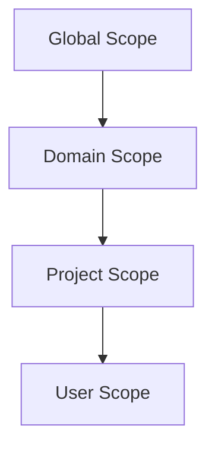

# Backend.AI 역할 기반 접근 제어 (RBAC) 기능 정의서

## 개요

본 문서는 Backend.AI의 역할 기반 접근 제어(RBAC) 시스템의 기능 요구사항을 정의합니다. RBAC 시스템은 Backend.AI의 모든 엔티티 타입에 걸쳐 통합되고 일관된 권한 관리 프레임워크를 제공하여, 현재의 단편화된 권한 로직을 대체하는 것을 목표로 합니다. 본 명세서는 RBAC 시스템의 기능과 동작을 정의하는 데 초점을 맞추며, 기술적 구현 세부사항은 BEP-1008에서 다룹니다.

## 동기

현재 Backend.AI 권한 시스템은 유지보수와 확장을 어렵게 만드는 몇 가지 중대한 한계를 가지고 있습니다:

1. **단편화되고 일관성 없는 권한 로직**: 각 엔티티 타입(Compute Session, VFolder, Image, Model Service 등)이 자체 권한 검사 로직을 구현합니다. 개발자는 권한이 어떻게 작동하는지 이해하기 위해 각 엔티티의 코드를 검토해야 합니다. 권한 처리가 엔티티 타입 간에 크게 달라, 유사한 작업에 대해 서로 다른 권한 모델, 시스템 전반에 걸친 일관성 없는 동작, 새로운 기능 추가 시 높은 유지보수 부담으로 이어집니다.

2. **제한된 세분성**: 현재 시스템은 유연한 권한 할당 기능 없이 기본적인 사용자 역할(superadmin, user)만 제공합니다.

3. **낮은 확장성**: 새로운 엔티티 타입이 추가될 때마다 각각 사용자 정의 권한 로직이 필요하여, 시스템 복잡도가 기하급수적으로 증가합니다.

4. **일관성 없는 협업 지원**: VFolder와 같은 일부 엔티티 타입은 초대 기반 공유 메커니즘을 가지고 있지만, 다른 엔티티 타입(예: Compute Sessions, Model Services)은 특정 권한으로 리소스를 공유하는 체계적인 방법이 부족합니다. 이러한 불일치는 사용자가 서로 다른 리소스 타입 간에 효과적으로 협업하는 것을 어렵게 만듭니다.

이러한 문제를 해결하기 위해, Backend.AI는 다음을 제공하는 통합 RBAC 시스템을 채택합니다:
- 모든 엔티티 타입에 걸친 일관된 권한 모델
- 유연한 역할 정의 및 할당
- 타입 및 리소스 수준 모두에서의 세분화된 권한 제어
- 협업 워크플로우에 대한 더 나은 지원

## 현재 설계 (As-is)

### 기존 사용자 역할

Backend.AI는 현재 두 가지 사용자 역할을 지원합니다:
- **superadmin**: 전체 시스템 접근 권한을 가진 글로벌 관리자
- **user**: 제한된 권한을 가진 일반 사용자

### 현재 권한 모델

Backend.AI의 각 엔티티 타입은 자체 권한 검사 로직을 구현합니다:

- **Compute Sessions**: 권한 검사가 세션 관리 코드 전체에 분산되어 있음
- **VFolders**: 사용자 정의 권한 로직을 가진 별도의 초대 시스템 사용
- **Images**: 사용자 소유권 및 가시성 설정 기반 권한 검사
- **Model Services**: 서비스별 권한 검증
- **Domains and Projects**: 암묵적 권한을 가진 계층적 소유권 모델

### 문제점

1. **코드 수준 권한 로직**: 권한이 데이터 기반이 아닌 애플리케이션 코드에 내장되어 있어, 권한 수정을 위해 코드 변경이 필요합니다.

2. **통합 인터페이스 부재**: 각 엔티티 타입이 권한 검사를 위한 서로 다른 메서드를 가지고 있어 다음을 어렵게 만듭니다:
   - 전체 권한 구조 이해
   - 시스템 전체의 권한 감사
   - 일관된 권한 검사 구현

3. **제한된 위임**: VFolder 초대와 같은 특정 기능을 제외하고는 다른 사용자에게 권한을 위임하는 체계적인 방법이 없습니다.

4. **유지보수 부담**: 권한 로직 변경 시 엔티티별 구현을 이해해야 하므로, 개발 시간과 오류 위험이 증가합니다.

## 제안된 설계 (To-be)

### 엔티티 타입

RBAC 시스템은 다음 엔티티 타입에 대한 권한을 관리합니다:

| 엔티티 타입 | 설명 | 이중 역할 |
|-------------|------|----------|
| Compute Session | 계산 워크로드 및 컨테이너 | 엔티티만 |
| VFolder | 데이터 저장을 위한 가상 폴더 | 엔티티만 |
| Image | 세션용 컨테이너 이미지 | 엔티티만 |
| Model Service | 모델 서빙 배포 | 엔티티만 |
| Domain | 관리 도메인 그룹핑 | 엔티티 & 스코프 |
| Project | 도메인 내 프로젝트 그룹핑 | 엔티티 & 스코프 |
| User | 사용자 계정 | 엔티티 & 스코프 |
| Role | 권한 집합 정의 | 엔티티만 |
| Role Assignment | 특정 스코프 내 사용자-역할 매핑 | 엔티티만 |

**참고**: Domain, Project, User는 관리 가능한 엔티티이자 권한 스코프로서 이중 역할을 합니다. Role은 어떤 권한이 사용 가능한지 정의하고, Role Assignment는 특정 스코프 내에서 사용자를 역할에 매핑합니다.

### 작업

모든 엔티티 타입은 동일한 작업 집합을 지원하여 시스템 전체에 일관성을 제공합니다:

| 작업 | 설명 |
|------|------|
| **create** | 이 타입의 새 엔티티 생성 |
| **read** | 엔티티 정보 및 메타데이터 조회 |
| **update** | 엔티티 속성 및 설정 수정 |
| **soft-delete** | 데이터를 제거하지 않고 삭제된 것으로 표시 |
| **hard-delete** | 엔티티 데이터 영구 제거 |

**Role 및 Role Assignment에 대한 삭제 작업 참고사항**:
Role 및 Role Assignment 엔티티는 초기 구현에서 soft-delete 및 hard-delete 작업을 지원합니다. Soft-delete는 감사 목적으로 엔티티를 비활성 상태로 보존하고 재활성화를 허용하는 반면, hard-delete는 활성 사용에서 엔티티를 영구적으로 제거합니다(감사 추적을 위해 데이터베이스 레코드는 보존될 수 있습니다).

**Role Assignment 작업 참고사항**:
- **create**: 특정 스코프 내에서 사용자에게 역할 할당 (`role_assignment` 엔티티 타입에 대한 `create` 권한 필요)
- **read**: 기존 Role Assignment 조회 (`role_assignment` 엔티티 타입에 대한 `read` 권한 필요)
- **update**: 만료 시간 또는 상태와 같은 Role Assignment 메타데이터 수정 (`role_assignment` 엔티티 타입에 대한 `update` 권한 필요)

스코프 내에서 Role Assignment를 관리하려면, 사용자는 `role_assignment` 엔티티 타입에 대한 해당 권한이 필요합니다. 예를 들어, Project Admin은 프로젝트 멤버에게 역할을 할당하고 관리하기 위해 `role_assignment`에 대한 `create` 및 `update` 권한이 필요합니다.

#### Soft-Delete vs Hard-Delete

- **soft-delete**: 기본 데이터를 제거하지 않고 데이터베이스에서 엔티티의 상태를 변경
  - 예시: VFolder를 휴지통으로 이동 (파일은 그대로 유지)
  - Role의 경우: 비활성으로 표시하여 새 Role Assignment는 방지하지만 기존 것은 유지
  - Role Assignment의 경우: 상태를 비활성으로 변경하여 권한을 중단하지만 할당 레코드는 보존
  - 복구를 허용하고 참조 무결성 유지
  - Soft-delete된 엔티티는 권한 있는 관리자가 재활성화 가능

- **hard-delete**: 엔티티와 관련된 실제 데이터 제거
  - 예시: 휴지통에 있는 VFolder의 파일 영구 삭제
  - Role의 경우: 역할 정의 제거 (활성 Role Assignment가 참조하지 않는 경우에만 허용)
  - Role Assignment의 경우: 할당 레코드 영구 제거
  - 참고: 감사 목적으로 데이터베이스 레코드는 보존될 수 있음

### 권한 위임

RBAC 시스템에서 권한 위임은 Role 및 Role Assignment 관리를 통해 달성되며, 특별한 "grant" 작업이 필요하지 않습니다.

**권한 위임 작동 방식**:
1. 원하는 권한을 가진 Role 생성 또는 식별
2. 대상 사용자를 해당 Role에 연결하는 Role Assignment 생성
3. 사용자가 Role에 정의된 모든 권한을 즉시 받음

**예시**: User B에게 VFolder 읽기 권한 부여:
1. 해당 VFolder에 대한 Object Permission을 가진 Role 생성 (또는 기존 Role 사용)
2. Role Assignment 생성: User B → VFolder Reader Role
3. User B는 이제 VFolder를 읽을 수 있음

**스코프 규칙**:
- 각 Role은 생성 시 단일 스코프에 바인딩됨
- Role Assignment는 해당 스코프 내에서 `role_assignment` 엔티티 타입에 대한 `create` 권한을 가진 사용자만 생성 가능
- 스코프 관리자는 자신의 스코프 내에서만 역할 및 할당 관리
- 크로스 스코프 공유는 계층적 위임이 아닌 Object Permission을 통해 활성화됨

**보안 제약**:

권한 상승을 방지하기 위해, RBAC 시스템은 Role Assignment 생성에 대해 엄격한 제약을 적용합니다:

1. **Role 읽기 권한 필요**: Role Assignment 생성에는 대상 Role에 대한 `read` 권한 필요
   - 사용자는 조회 권한이 있는 Role만 할당 가능
   - 이는 사용자가 임의의 Role을 맹목적으로 할당할 수 없도록 보장

2. **스코프 기반 접근 제어**: Role 읽기 권한은 스코프에 바인딩됨
   - Project-A 스코프에서 `role:read` 권한을 가진 Project Admin은 Project-A에 바인딩된 Role만 읽을 수 있음
   - Project Admin은 Global 스코프 Role이나 다른 프로젝트의 Role을 읽을 수 없음
   - 이는 Project Admin이 Global Admin 또는 다른 크로스 스코프 Role을 할당하는 것을 방지

3. **결합된 보호**: 이 두 메커니즘이 함께 권한 상승을 방지
   - Project Admin이 `role_assignment:create` 권한을 가지고 있어도
   - Global Admin 역할을 할당할 수 없는 이유:
     - Global 스코프에서 `role:read` 권한이 없음
     - Global 스코프 Role을 발견하거나 참조할 수 없음

**예시 - Project Admin이 권한 상승할 수 없는 이유**:
```
Project Admin (Project-A 스코프)가 가진 권한:
- 권한: role:read, role:create, role_assignment:create (모두 Project-A 스코프에서)

Global Admin 역할 할당 시도:
1. Project Admin이 Role Assignment 생성 시도: User X → Global Admin
2. 시스템 검사: Project Admin이 Global Admin에 대한 `role:read` 권한을 가지고 있는가?
3. Global Admin은 Global 스코프에 바인딩됨
4. Project Admin은 Project-A 스코프에서만 `role:read` 권한을 가짐
5. ❌ 권한 거부 - Global Admin 역할을 읽을 수 없음
6. ❌ Role Assignment 생성 불가
```

### 권한 타입

RBAC 시스템은 두 가지 타입의 권한을 제공합니다:

#### 1. Permission (타입 수준 권한)

특정 스코프 내에서 **엔티티 타입**에 대한 작업 권한을 정의합니다.

- 지정 사항: 엔티티 타입 (예: `vfolder`) + 작업 (예: `read`)
- 스코프 내에서 접근 가능한 해당 타입의 모든 엔티티에 적용
- 예시: `vfolder:read` 권한은 스코프 내 모든 VFolder 읽기 허용
- 단일 스코프에 바인딩된 Role의 Permission Group 내에 그룹화됨

#### 2. Object Permission (인스턴스 수준 권한)

**특정 엔티티 인스턴스**에 대한 작업 권한을 정의합니다.

- 지정 사항: 엔티티 타입 + 엔티티 ID + 작업
- 해당 특정 엔티티에만 적용
- 예시: `vfolder:{id}:read` 권한은 해당 특정 VFolder만 읽기 허용
- 다른 스코프의 엔티티를 참조할 수 있어 크로스 스코프 공유 가능
- Role의 스코프 바인딩과 독립적으로 Role에 직접 첨부됨

**크로스 스코프 Object Permission**:
Project-A 스코프에 바인딩된 Role은 Project-B 스코프의 엔티티에 대한 Object Permission을 포함할 수 있습니다. 이는 다음과 같은 시나리오를 가능하게 합니다:
- 개인 VFolder를 프로젝트 팀 멤버와 공유
- 프로젝트 간에 특정 세션에 대한 접근 권한 부여
- 여러 스코프에 걸친 협업 워크플로우

### Role 구조

RBAC 시스템의 각 Role은 다음 구조를 가집니다:

**핵심 속성**:
- **Name**: 사람이 읽을 수 있는 역할 이름 (예: "Project-A-Admin", "VFolder-X-Reader")
- **Description**: 역할 목적에 대한 선택적 설명
- **Scope Binding**: 모든 Role은 정확히 하나의 스코프에 바인딩됨 (Global, Domain, Project, 또는 User)
- **Source**: 역할이 시스템 생성인지 사용자 정의인지 표시

**권한 구성요소**:
- **Permissions**: Role의 바인딩된 스코프 내에서 적용되는 타입 수준 권한 모음 (엔티티 타입 + 작업)
  - 스코프를 나타내는 "Permission Group"에 내부적으로 그룹화됨
  - 예시: `vfolder:read`, `compute_session:create`
- **Object Permissions**: 인스턴스 수준 권한 모음 (엔티티 타입 + 엔티티 ID + 작업)
  - 모든 스코프의 엔티티를 참조할 수 있어 크로스 스코프 공유 가능
  - 예시: `vfolder:abc-123:read`

**참고**: "Permission Group"은 Permission을 Role의 스코프와 연결하는 내부 구조입니다. 사용자 관점에서 Role은 단순히 스코프와 권한 목록을 가집니다.

### Role Source

RBAC 시스템의 Role은 생성 방법을 나타내는 source 속성을 가집니다:

| Role Source | 설명 | 관리 |
|-------------|------|------|
| **system** | 시스템에 의해 자동 생성됨 | 스코프 생성 시 생성됨; 삭제 불가 |
| **custom** | 관리자에 의해 수동 생성됨 | 적절한 권한을 가진 사용자가 생성, 수정, 삭제 가능 |

#### System Roles

새 스코프(Domain, Project, 또는 User)가 생성되면, 시스템은 해당 스코프에 대한 관리자 역할을 자동으로 생성합니다:

- **Domain 생성** → Domain Admin 역할 (system sourced, 해당 도메인 스코프에 바인딩)
- **Project 생성** → Project Admin 역할 (system sourced, 해당 프로젝트 스코프에 바인딩)
- **User 생성** → User Owner 역할 (system sourced, 해당 사용자 스코프에 바인딩)

System role은 모든 스코프가 해당 스코프 내에서 리소스를 관리할 수 있는 최소 한 명의 관리자를 가지도록 보장합니다.

### Role Assignment 엔티티

Role Assignment는 특정 스코프 내에서 사용자를 역할에 매핑하는 별도의 엔티티입니다. 이 설계는 여러 이점을 제공합니다:

**주요 특성**:
- **관심사 분리**: Role 정의가 Role Assignment와 독립적
- **유연한 관리**: Role 자체를 수정하지 않고 Role Assignment를 생성 및 관리
- **감사 추적**: 각 할당이 누가 언제 부여했는지 추적
- **일관된 작업**: 특수 목적 작업 대신 표준 create/read/update 작업 사용

**Role Assignment 속성**:
- `user_id`: 역할을 받는 사용자
- `role_id`: 할당되는 역할
- `scope_type` 및 `scope_id`: 역할이 적용되는 위치
- `granted_by`: 이 할당을 생성한 사람
- `granted_at`: 할당이 생성된 시간
- `state`: 활성 또는 비활성

**예시**:
- Role: "Project-A-User" (Project A에 대한 권한 정의)
- Role Assignment: User Alice → "Project-A-User" 역할
- 결과: Alice는 Project A 스코프 내에서 "Project-A-User" 역할에 정의된 권한을 가짐

**Role Assignment 관리**:

Role Assignment는 스코프 내에서 적절한 권한을 가진 사용자가 관리할 수 있습니다:

- **Create**: 스코프에서 `role_assignment:create` 권한을 가진 사용자가 새 Role Assignment 생성 가능
- **Read**: `role_assignment:read` 권한을 가진 사용자가 스코프 내 Role Assignment 조회 가능
- **Update**: `role_assignment:update` 권한을 가진 사용자가 Role Assignment 메타데이터 수정 가능 (예: 상태를 비활성에서 활성으로 변경, 만료 시간 업데이트)
- **Delete**: `role_assignment:soft-delete` 또는 `role_assignment:hard-delete` 권한을 가진 사용자가 Role Assignment 제거 가능

**스코프 관리자**: 스코프의 관리자 역할에 할당된 사용자(예: Domain Admin, Project Admin)는 일반적으로 해당 스코프에 대한 모든 Role Assignment 관리 권한을 가지며, 다음을 수행할 수 있습니다:
- 스코프 내 사용자에게 역할 할당
- 소프트 삭제 또는 비활성화를 통해 역할 할당 취소
- 소프트 삭제 또는 비활성 Role Assignment 재활성화
- 스코프 내 모든 역할 할당 조회

### 스코프 계층

Backend.AI는 4단계 스코프 계층을 사용합니다:



**스코프 특성**:
- **Global Scope**: 시스템 전체 리소스 및 권한
- **Domain Scope**: 시스템 내 조직 단위
- **Project Scope**: 도메인 내 협업 작업 공간
- **User Scope**: 개별 사용자의 개인 리소스

**관리 원칙**:
각 스코프는 해당 관리자가 독립적으로 관리합니다:
- **Global Admin**: 글로벌 스코프 리소스 관리
- **Domain Admin**: 자신의 도메인 스코프 리소스 관리
- **Project Admin**: 자신의 프로젝트 스코프 리소스 관리
- **User Owner**: 자신의 사용자 스코프 리소스 관리

**중요: 권한 상속 없음**:
특정 스코프에 바인딩된 Role에 정의된 권한은 **해당 스코프 내의 작업에만** 적용됩니다. 하위 스코프로 **캐스케이드되지 않습니다**.

예시:
- Domain-A 스코프에 바인딩된 Domain Admin 역할이 `vfolder:read` Permission을 가지면 **도메인 수준의 VFolder만** 읽을 수 있음
- 이 권한은 Domain-A 내 프로젝트의 VFolder에 대한 접근을 **자동으로 부여하지 않음**
- Project-A(Domain-A의 하위)의 리소스에 접근하려면, Project-A 스코프에 바인딩된 별도의 Role이 필요
- 또는 Object Permission을 사용하여 하위 스코프의 특정 리소스에 대한 접근 권한 부여

**크로스 스코프 접근**:
- 스코프 관리자는 동일한 수준의 다른 스코프에서 리소스를 직접 관리할 수 없음
- 크로스 스코프 협업은 계층적 위임이 아닌 Object Permission을 통해 달성됨
- 스코프 간 작업을 하려면 사용자에게 다음 중 하나가 필요:
  1. 여러 Role Assignment (스코프당 하나)
  2. 다른 스코프의 특정 리소스에 대한 Object Permission

### 스코프 삭제 정책

스코프(Domain, Project, 또는 User)를 삭제할 때, RBAC 시스템은 필요할 때 유연성을 제공하면서 우발적인 데이터 손실을 방지하기 위한 엄격한 정책을 적용합니다.

**기본 동작 (캐스케이드 거부)**:

기본적으로 시스템은 종속 Role 또는 Role Assignment가 존재하면 스코프 삭제를 거부합니다:

- **Soft-delete 스코프**: 시스템이 이 스코프에 바인딩된 Role을 확인
  - Role이 존재하면: 영향을 받는 모든 Role을 나열하는 오류 반환
  - 관리자는 먼저 명시적으로 Role을 soft-delete 또는 hard-delete해야 함
  - 이는 관리자가 삭제 전 모든 권한 구조를 인식하도록 보장

- **Hard-delete 스코프**: 시스템이 이 스코프에 바인딩된 Role을 확인
  - Role이 존재하면: 영향을 받는 모든 Role을 나열하는 오류 반환
  - 관리자는 먼저 명시적으로 모든 Role과 그들의 Role Assignment를 hard-delete해야 함
  - 이는 명시적인 조치 없이 권한 정의의 영구적 손실을 방지

**강제 삭제 옵션**:

관리 편의성과 대량 작업을 위해, 시스템은 강제 삭제 옵션을 제공합니다:

- **강제 Soft-delete**: 활성화되면 모든 종속 엔티티를 자동으로 soft-delete
  - 스코프에 바인딩된 모든 Role을 자동으로 soft-delete
  - 해당 Role의 모든 Role Assignment도 soft-delete됨
  - 참조 무결성 유지 - 모든 것을 함께 복원 가능
  - 모든 soft-delete된 엔티티는 관계를 유지

- **강제 Hard-delete**: 활성화되면 모든 종속 엔티티를 자동으로 hard-delete
  - 스코프에 바인딩된 모든 Role을 자동으로 hard-delete
  - 해당 Role의 모든 Role Assignment도 hard-delete됨
  - 데이터베이스 감사 레코드는 보존될 수 있음
  - 되돌릴 수 없음 - 주의해서 사용

**System Role 보호**:

시스템 생성 Role(Domain Admin, Project Admin, User Owner)은 동일한 삭제 규칙을 따릅니다:
- 스코프가 존재하는 동안 개별적으로 삭제 불가
- 스코프 삭제 시 자동으로 관리됨
- 강제 삭제가 사용되면 시스템 역할도 스코프와 함께 삭제됨

**예시**:

**예시 1: 안전한 삭제 (기본 동작)**
1. 관리자가 Project-A를 hard-delete 시도
2. 시스템이 project-A에 바인딩된 3개의 Role과 이들을 사용하는 15개의 Role Assignment를 발견
3. 시스템이 영향을 받는 모든 Role을 나열하는 오류 메시지로 삭제 거부
4. 관리자는 먼저 수동으로 Role을 삭제하거나 강제 삭제 옵션을 사용해야 함

**예시 2: 강제 삭제**
1. 관리자가 강제 옵션을 활성화하여 Project-A를 hard-delete
2. 시스템이 자동으로 15개의 Role Assignment, 그 다음 3개의 Role, 그 다음 스코프를 hard-delete
3. 모든 엔티티가 영구적으로 제거됨
4. 감사 로그가 CRITICAL 심각도로 작업을 기록

**모범 사례**:
- 스코프 삭제 전 모든 Role 검토
- 복원 가능성이 있는 스코프에는 soft-delete 사용
- 강제 삭제는 정리 작업 및 테스트 환경에 한정
- 프로덕션 스코프를 강제 삭제하기 전 항상 스테이징에서 검증

### 관리 안전장치

RBAC 시스템은 운영 유연성을 유지하면서 관리 접근 권한의 우발적 손실을 방지하기 위한 안전장치를 포함합니다.

#### 마지막 관리자 경고

스코프 내 관리자 역할에 대한 Role Assignment를 제거(soft-delete, hard-delete, 또는 비활성화)하려고 할 때, 시스템은 이것이 해당 스코프의 마지막 활성 관리자인지 확인합니다.

**경고 요구사항**:

작업이 스코프에 활성 관리자가 없는 결과를 초래하는 경우:

1. **경고 표시**: 시스템은 사용자에게 눈에 띄는 경고를 표시해야 함
   - 이것이 스코프의 마지막 관리자임을 명확히 표시
   - 스코프가 정상 작업을 통해 관리 불가능하게 됨을 설명
   - 복구를 위해 시스템 관리자 개입이 필요함을 알림

2. **명시적 확인**: 작업에 명시적인 사용자 확인이 필요
   - 사용자가 결과를 이해했음을 인정해야 함
   - 단순한 "예/아니오" 확인은 불충분

3. **감사 로깅**: 마지막 관리자 제거는 CRITICAL 심각도로 로깅되어야 함
   - 스코프, 역할, 사용자 및 제거를 수행한 사람을 기록
   - 감사 검토에서 특별한 주의가 필요한 것으로 표시

**관리자 역할 감지**:

시스템은 다음을 통해 관리자 역할을 식별합니다:
- 스코프에서 `role_assignment:create` 권한을 가진 Role
- 시스템 생성 관리자 역할 (Domain Admin, Project Admin, User Owner)
- 관리자로 명시적으로 표시된 사용자 정의 역할

#### 시스템 관리자 복구

스코프가 모든 관리자를 잃을 때(우발적이든 의도적이든), 시스템 관리자가 접근 권한을 복원할 수 있어야 합니다.

**복구 기능**:

시스템은 권한 있는 시스템 관리자를 위한 메커니즘을 제공해야 합니다:

1. **직접 Role Assignment 생성**: 고아가 된 스코프에 대한 새 Role Assignment 생성
   - 높은 권한으로 정상 권한 검사 우회
   - 스코프의 시스템 생성 관리자 역할을 대상으로 함
   - 감사 목적으로 긴급 개입 로깅

2. **Soft-Delete된 할당 재활성화**: 이전에 soft-delete된 관리자 Role Assignment 복원
   - 스코프에 대한 비활성 관리자 Role Assignment 찾기
   - 상태를 비활성에서 활성으로 변경
   - 재활성화를 수행한 사람을 기록

3. **긴급 관리 인터페이스**: 복구 작업을 위한 전용 인터페이스 제공
   - Global Admin 또는 시스템 운영자만 접근 가능
   - 안전 확인 및 확인 프롬프트 포함
   - 감사 준수를 위한 문서화된 정당성 필요

**문서화 요구사항**:

Backend.AI를 배포하는 조직은 다음을 문서화해야 합니다:
- 고아가 된 스코프에 대한 긴급 복구 절차
- 복구를 수행할 권한이 있는 인원의 연락처 정보
- 복구 후 검증 단계
- 인시던트 대응 절차

**예방 모범 사례**:
- 중요한 스코프당 최소 2명의 활성 관리자 유지
- 스코프 전체의 관리자 접근에 대한 정기 감사
- 마지막 관리자 제거 이벤트에 대한 모니터링 및 알림

### 리소스 소유권

RBAC 시스템에서 리소스 소유권은 별도의 소유권 개념이 아닌 자동 Role Assignment 생성을 통해 관리됩니다.

**소유권 모델**:

사용자가 리소스(VFolder, Compute Session, Model Service 등)를 생성할 때, 시스템은 자동으로:
1. 해당 리소스에 대한 전체 Object Permission을 가진 Role을 생성 또는 식별
2. 생성자를 해당 Role에 연결하는 Role Assignment 생성
3. 생성자는 리소스에 대한 모든 권한(create, read, update, delete)을 받음

**예시 - VFolder 생성**:
```
1. User A가 Project-A에서 VFolder-X 생성
2. 시스템이 자동으로:
   a. Object Permission을 가진 Role 생성/찾기:
      - vfolder:X:read
      - vfolder:X:update
      - vfolder:X:soft-delete
      - vfolder:X:hard-delete
   b. Role Assignment 생성: User A → VFolder-X-Owner Role
3. User A는 이제 VFolder-X에 대한 완전한 제어권을 가짐
```

**중요한 의미**:

1. **특별한 소유자 상태 없음**: 소유자는 단지 전체 권한을 부여하는 Role Assignment를 가진 사용자임
2. **양도 가능한 소유권**: 다른 사용자를 위한 새 Role Assignment를 생성하여 소유권 이전 가능
3. **취소 가능한 소유권**: 생성자의 Role Assignment가 비활성화되면, 자신의 리소스에 대한 접근 권한을 잃음
4. **Self-Lockout 위험**: 사용자는 실수로 자신의 접근 권한을 취소하지 않도록 주의해야 함

**소유권 위임**:
- 리소스 생성자는 추가 Role Assignment를 생성하여 특정 권한을 위임할 수 있음
- 여러 사용자가 별도의 Role Assignment를 통해 "소유자 같은" 권한을 가질 수 있음
- 단일 "소유자" 개념 없음 - 모든 접근은 Role을 통해 제어됨

**스코프 수준 리소스**:

리소스는 다양한 스코프 수준에서 소유될 수 있습니다:
- **User 스코프 리소스**: 개인 리소스 (예: 개인 VFolder)
  - 개별 사용자가 생성 및 소유
  - 기본적으로 소유자만 접근 가능
- **Project 스코프 리소스**: 프로젝트 내 공유 리소스
  - 프로젝트 멤버가 생성, 프로젝트 수준에서 소유
  - 프로젝트 멤버가 자신의 역할에 따라 접근 가능
- **Domain 스코프 리소스**: 조직 전체 리소스
  - 도메인 수준에서 소유
  - 도메인 멤버가 자신의 역할에 따라 접근 가능
  - *참고*: 아직 모든 리소스 타입이 도메인 스코프 소유권을 지원하지는 않음

**리소스 타입별 현재 스코프 지원**:

범례:
- ✅ **Yes**: 현재 지원됨
- ⏳ **Not yet**: 향후 구현 예정
- ❌ **No**: 계획되지 않았거나 해당 없음

| 리소스 타입 | User Scope | Project Scope | Domain Scope |
|-------------|------------|---------------|--------------|
| VFolder | ✅ Yes | ✅ Yes | ⏳ Not yet |
| Compute Session | ✅ Yes | ✅ Yes | ❌ No |
| Model Service | ✅ Yes | ✅ Yes | ❌ No |
| Image | ❌ No | ✅ Yes | ✅ Yes |

**향후 예시 - Domain 수준 VFolder**:
Domain 수준 VFolder가 구현되면:
- Domain Admin이 도메인 스코프에서 VFolder 생성
- 해당 도메인의 모든 사용자가 도메인 수준 권한에 따라 접근 가능
- Domain Admin 역할에 도메인 스코프 VFolder에 대한 `vfolder:read` 권한 포함

### 권한 충돌 해결

사용자가 동일한 리소스에 대해 서로 다른 권한을 부여하는 여러 Role Assignment를 가질 때, RBAC 시스템은 **합집합(가산적) 모델**을 사용하여 충돌을 해결합니다.

**해결 규칙**:

1. **권한의 합집합**: 모든 Role Assignment의 모든 권한이 결합됨
2. **거부 메커니즘 없음**: 이 RBAC 시스템에는 명시적인 "거부" 권한이 없음
3. **가장 허용적인 것이 우선**: 어떤 Role이라도 권한을 부여하면 사용자가 그 권한을 가짐

**예시**:
```
User B는 두 개의 Role Assignment를 가짐:
- Role A: vfolder:X:read
- Role B: vfolder:X:read, vfolder:X:update

VFolder-X에 대한 User B의 효과적인 권한:
- vfolder:X:read ✅ (두 역할 모두에서)
- vfolder:X:update ✅ (Role B에서)

결과: User B는 VFolder-X를 읽고 업데이트할 수 있음
```

**의미**:

- **가산만 가능**: 더 많은 Role Assignment 추가는 더 많은 권한만 부여할 수 있으며, 더 적게 부여할 수는 없음
- **추가로 인한 취소 불가**: "거부" 역할을 추가하여 접근을 제한할 수 없음
- **명시적 비활성화 필요**: 권한을 취소하려면 권한을 부여하는 Role Assignment를 비활성화해야 함
- **감사 복잡성**: 사용자의 권한을 이해하려면 모든 Role Assignment를 검토해야 함

**모범 사례**:
- Role Assignment를 최소화하고 잘 문서화
- 사용자의 효과적인 권한을 정기적으로 감사
- 권한 수준을 나타내는 설명적인 Role 이름 사용
- 상충되는 의도를 가진 중복 Role 생성 회피

### 주요 사용 사례

#### 1. VFolder 공유

**시나리오**: User A가 협업을 위해 User B와 VFolder를 공유하려고 합니다.

**방법 1: 공유/초대 API 사용 (하위 호환성)**

이 편의 API는 기존 VFolder 초대 워크플로우와의 호환성을 유지합니다. 내부적으로는 RBAC 시스템(방법 2)을 사용하지만 더 간단한 인터페이스를 제공합니다.

**흐름**:
1. User A가 대상 사용자와 원하는 권한으로 VFolder 공유 API 호출
2. 시스템이 자동으로:
   - 해당 VFolder에 대한 Object Permission을 가진 Role을 찾거나 생성
   - User B를 해당 Role에 연결하는 Role Assignment 생성
3. User B는 이제 VFolder 내용을 읽고 수정할 수 있음
4. User A는 Role Assignment 상태를 비활성으로 업데이트하여 취소 가능

**구현 참고사항**: 공유/초대 API는 RBAC 작업을 감싸는 얇은 래퍼입니다. 모든 공유는 Role 및 Role Assignment 엔티티로 저장됩니다.

**지원 중단 계획**: 이 API는 기존 클라이언트 및 UI와의 하위 호환성을 위해 유지됩니다. 새로운 통합은 더 큰 유연성을 위해 방법 2(직접 RBAC)를 사용해야 합니다. 모든 클라이언트가 RBAC 기반 인터페이스로 마이그레이션되면 향후 주요 버전에서 공유/초대 API가 지원 중단될 수 있습니다.

**방법 2: Role 및 Role Assignment 사용 (직접 RBAC - 권장)**

이 방법은 핵심 RBAC 프리미티브를 직접 사용하며 새로운 구현에 권장되는 접근 방식입니다:

**흐름**:
1. User A가 VFolder에 적합한 Role이 있는지 확인:
   - `vfolder:{id}:read` 및 `vfolder:{id}:update` Object Permission을 가진 Role 검색
2. 찾지 못하면 User A가 새 Role 생성:
   - User A의 스코프에 바인딩
   - Object Permission 추가: `vfolder:{id}:read`, `vfolder:{id}:update`
3. User A가 Role Assignment 생성:
   - User B를 VFolder Reader Role에 연결
4. User B는 이제 VFolder 내용을 읽고 수정할 수 있음
5. 취소하려면 User A가 Role Assignment 상태를 비활성으로 업데이트

**방법 2의 장점**:
- 완전한 RBAC 유연성 (하나의 Role에 여러 Object Permission 결합 가능)
- 다른 리소스 타입과 일관됨
- 고급 시나리오 지원 (여러 사용자, 복잡한 권한 집합)
- RBAC 시스템이 발전함에 따라 향후에도 사용 가능

#### 2. 세션 접근 제어

**시나리오**: Project Admin이 팀 멤버가 특정 compute session에 접근할 수 있도록 하려고 합니다.

**흐름**:
1. Project Admin은 프로젝트 스코프에서 `role` 및 `role_assignment` 엔티티 타입에 대한 `create` 권한을 가짐
2. Project Admin이 Object Permission을 가진 Role 생성 (또는 기존 것 사용):
   - `compute_session:{session_id_1}:read`
   - `compute_session:{session_id_2}:read`
3. Project Admin이 팀 멤버를 이 Role에 연결하는 Role Assignment 생성
4. 팀 멤버는 해당 특정 세션의 세부 정보 및 출력을 볼 수 있음
5. 팀 멤버는 Role에 추가 Permission이 없으면 세션을 생성하거나 삭제할 수 없음

#### 3. 프로젝트 관리

**시나리오**: Domain Admin이 새 프로젝트를 생성하고 Project Admin을 할당합니다.

**흐름**:
1. Domain Admin이 새 Project 생성
2. 시스템이 프로젝트 스코프에 대한 Project Admin 역할(system sourced) 자동 생성
3. Domain Admin이 사용자를 Project Admin 역할에 연결하는 Role Assignment 생성
4. Project Admin은 이제 프로젝트 스코프 내 모든 리소스를 관리할 수 있음
5. Project Admin은 프로젝트 멤버를 위한 사용자 정의 Role 및 Role Assignment 생성 가능

#### 4. 프로젝트 멤버에게 역할 할당

**시나리오**: Project Admin이 팀 멤버에게 역할을 할당하여 특정 권한을 부여하려고 합니다.

**흐름**:
1. Project Admin은 프로젝트 스코프에서 `role_assignment` 엔티티 타입에 대한 `create` 권한을 가짐
2. Project Admin이 적절한 Role 식별 (예: "Project User" 시스템 역할)
3. Project Admin이 팀 멤버를 "Project User" 역할에 연결하는 Role Assignment 생성
4. 팀 멤버는 "Project User" 역할에 정의된 모든 Permission을 즉시 받음
5. Project Admin은 나중에 Role Assignment 상태를 비활성으로 업데이트하여 접근 취소 가능

#### 5. 사용자 정의 역할 생성 및 할당

**시나리오**: Project Admin이 특정 권한을 가진 "Project-A-ML-Researcher" 역할을 생성하고 팀 멤버에게 할당하려고 합니다.

**흐름**:
1. Project Admin은 프로젝트 스코프에서 `role` 및 `role_assignment` 엔티티 타입 모두에 대한 `create` 권한을 가짐
2. Project Admin이 "Project-A-ML-Researcher"라는 사용자 정의 역할 생성:
   - Project A 스코프에 바인딩
   - Permission 추가: `compute_session:create`, `compute_session:read`
   - Permission 추가: `vfolder:read`, `image:read`
3. Project Admin이 특정 팀 멤버를 "Project-A-ML-Researcher" 역할에 연결하는 Role Assignment 생성
4. 팀 멤버는 이제:
   - Project A 내에서 compute session 생성 및 읽기 가능
   - Project A 내에서 VFolder 및 이미지 읽기 가능
   - 추가 Permission이 없으면 리소스를 수정하거나 삭제할 수 없음
5. Project Admin은 역할의 Permission을 업데이트(추가/제거)할 수 있으며, 변경 사항은 이 역할에 할당된 모든 사용자에게 자동으로 적용됨

### 마이그레이션 전략

#### 사용자 역할 매핑

기존 사용자 역할은 RBAC 시스템으로 자동 마이그레이션됩니다:

| 현재 역할 | 대상 RBAC 역할 | 스코프 |
|----------|--------------|--------|
| superadmin | Global Admin | Global 스코프 |
| user | User Owner | 사용자 자신의 스코프 |

#### 프로젝트 멤버십 매핑

프로젝트와 연결된 사용자는 적절한 프로젝트 역할을 받습니다:

| 현재 상태 | 대상 RBAC 역할 | 스코프 |
|----------|--------------|--------|
| 프로젝트 멤버 (superadmin) | Project Admin | Project 스코프 |
| 프로젝트 멤버 (user) | Project User | Project 스코프 |

**여러 프로젝트 멤버십**:
- 100개 프로젝트의 멤버인 사용자는 100개의 별도 Project User (또는 Project Admin) Role Assignment를 받음
- 각 Role Assignment는 해당 프로젝트 스코프에 바인딩됨
- 이는 사용자가 참여하는 각 프로젝트에서 적절한 권한을 가지도록 보장

**Project User 역할** (system sourced, 프로젝트 스코프에 바인딩)은 다음을 가짐:
- Permission: `compute_session:create`, `compute_session:read`
- Permission: `vfolder:read`, `image:read`, `model_service:read`
- Project Admin이 특정 리소스에 대해 Object Permission 추가 가능

#### 리소스 소유권 마이그레이션

각 기존 리소스(VFolder, Compute Session, Model Service 등)에 대해 마이그레이션 프로세스는:

1. **리소스 생성자 식별**: 리소스를 생성한 사용자 결정
2. **소유자 Role 생성**: 해당 리소스에 대한 전체 Object Permission을 가진 Role을 생성 또는 찾기
   - Object Permission: `{resource_type}:{resource_id}:read`, `update`, `soft-delete`, `hard-delete`
3. **Role Assignment 생성**: 생성자를 소유자 Role에 연결
4. **접근 보존**: 생성자가 마이그레이션 후 리소스에 대한 완전한 제어를 유지하도록 보장

#### VFolder 초대 마이그레이션

기존 VFolder 초대 시스템은 Role 및 Role Assignment로 마이그레이션됩니다:

1. 각 VFolder 초대에 대해:
   - 해당 VFolder에 대한 Object Permission을 가진 Role을 생성 또는 찾기
   - 초대된 사용자를 해당 Role에 연결하는 Role Assignment 생성
2. 초대 권한 매핑:
   - `read` 권한 → `vfolder:{id}:read` Object Permission
   - `write` 권한 → `vfolder:{id}:read` + `vfolder:{id}:update` Object Permission
3. RBAC 시스템을 감싸는 편의 계층으로 공유/초대 API 유지
4. 기존 권한 검사를 통합 RBAC 검사로 대체

**하위 호환성**:
- VFolder 공유/초대 API는 내부적으로 Role + Role Assignment를 사용하여 계속 작동
- VFolder 공유를 위한 기존 UI는 변경되지 않음
- 사용자는 더 많은 유연성을 위해 직접 RBAC 기능을 사용하도록 점진적으로 권장됨

#### 마이그레이션 프로세스

1. **마이그레이션 전 분석**: 기존 권한 및 사용자 역할 감사
2. **스키마 배포**: 기존 테이블과 함께 RBAC 테이블 생성
3. **데이터 마이그레이션**: 기존 권한 데이터를 RBAC 형식으로 변환
4. **검증**: 마이그레이션된 권한이 원래 동작과 일치하는지 확인
5. **이중 쓰기 단계**: 코드가 기존 및 새 권한 시스템 모두에 쓰도록 마이그레이션
   - 모든 권한 변경이 레거시 테이블과 RBAC 테이블 모두에 기록됨
   - 전환 중 시스템 간 일관성 보장
   - 지속 시간: 검증이 완료되고 모든 하위 시스템이 마이그레이션될 때까지
6. **RBAC 읽기 전환**: 권한 검사를 RBAC 시스템에서 읽도록 전환
   - 레거시 시스템 호환성 유지를 위해 이중 쓰기 계속
   - 권한 거부 및 예상치 못한 동작 모니터링
7. **레거시 시스템 비활성화**: 레거시 권한 테이블에 쓰기 중지
8. **레거시 정리**: 성공적인 마이그레이션 후 기존 권한 테이블 및 코드 제거

**중요 참고사항**:
- **롤백 전략 없음**: 이중 쓰기 접근 방식은 전진만 보장
  - 롤백하려면 RBAC 변경 사항을 잃으면서 레거시 시스템을 복원해야 함
  - 대신 문제는 RBAC 시스템에서 전진 방향으로 수정
  - 프로덕션 마이그레이션 전 스테이징 환경에서 광범위한 테스트 필요
- **점진적 마이그레이션**: 다른 엔티티 타입을 단계적으로 마이그레이션 가능
  - 각 엔티티 타입의 마이그레이션을 독립적으로 검증하여 위험 감소
  - 반복적인 수정 및 개선 허용

## 감사 및 규정 준수

RBAC 시스템은 모든 권한 관련 활동을 추적하고 규정 준수 요구사항을 지원하기 위한 포괄적인 감사 로깅을 포함합니다.

### 감사 로그 범위

모든 RBAC 작업이 감사 로그에 기록됩니다:

**역할 관리**:
- Role 생성, 수정 및 삭제
- 역할 권한 변경 (Permission 및 Object Permission 추가/제거)
- Role 스코프 바인딩 변경

**Role Assignment 관리**:
- Role Assignment 생성 (누가 누구에게 어떤 역할을, 어느 스코프에서 부여했는지)
- Role Assignment 삭제 (누가 접근을 취소했는지)
- Role Assignment 상태 변경 (활성/비활성 전환)

**권한 검사**:
- 접근 시도 (성공 및 거부)
- 접근한 리소스 및 시도한 작업
- 접근 시점의 사용자 ID 및 효과적인 권한
- 권한을 부여한 역할 (성공적인 접근의 경우)

**관리 작업**:
- 스코프 생성 및 삭제
- 시스템 역할 생성 (자동)
- 권한 정책 변경

### 감사 로그 속성

각 감사 로그 항목에 포함되는 내용:

- **Timestamp**: 작업이 발생한 시간
- **Actor**: 작업을 수행한 사용자
- **Action Type**: 수행된 작업 (예: `role_assignment.create`, `permission.check`)
- **Target**: 영향을 받은 엔티티 (예: Role ID, User ID, Resource ID)
- **Scope**: 작업이 발생한 위치
- **Result**: 성공 또는 실패
- **Details**: 추가 컨텍스트 (관련된 권한, 거부 이유 등)

### 규정 준수 지원

감사 로그는 다음을 가능하게 합니다:

- **접근 검토**: 누가 어떤 리소스에 접근할 수 있는지 정기적 검토
- **이상 탐지**: 비정상적인 권한 부여 패턴 식별
- **포렌식**: 권한 변경을 추적하여 보안 인시던트 조사
- **규제 준수**: 규정 준수 감사를 위한 접근 제어 증명 (SOC 2, ISO 27001 등)
- **책임 추적**: 누가 권한을 부여하거나 취소했는지 추적

### 감사 로그 쿼리 기능

관리자는 다음과 같은 질문에 답하기 위해 감사 로그를 쿼리할 수 있습니다:
- 지난 30일 동안 리소스 X에 접근한 사람은?
- 사용자 Y에게 관리자 권한이 언제 부여되었는가?
- 사용자 Z가 현재 어떤 권한을 가지고 있으며 어떻게 받았는가?
- 누가 사용자 U에게 역할 R을 부여했는가?
- 프로젝트 P에서 어떤 권한 거부가 발생했는가?

## 사용자 또는 개발자에게 미치는 영향

### 사용자

**개선 사항**:
- **통합 권한 모델**: 모든 엔티티 타입에 걸친 일관된 권한 동작
- **세분화된 제어**: 특정 권한으로 특정 리소스를 공유할 수 있는 능력
- **더 나은 협업**: 유연한 권한 할당으로 더 쉬운 팀 워크플로우
- **투명성**: 누가 어떤 리소스에 접근할 수 있는지 명확하게 확인

**변경 사항**:
- 일부 기존 권한 동작이 통합 모델에 맞춰 변경될 수 있음
- 사용자는 새로운 역할 및 권한 개념을 이해해야 함
- 관리 인터페이스가 RBAC 관리를 지원하도록 업데이트됨

### 개발자

**개선 사항**:
- **간소화된 권한 검사**: 모든 권한 검증을 위한 단일 인터페이스
- **데이터 기반 권한**: 권한 수정을 위해 코드 변경 불필요
- **더 쉬운 유지보수**: 모든 엔티티 타입에 걸친 일관된 권한 로직
- **더 나은 확장성**: 새로운 엔티티 타입이 자동으로 RBAC 프레임워크 상속

**변경 사항**:
- 엔티티별 권한 코드를 RBAC API 호출로 대체
- 역할 및 권한 관리를 지원하도록 GraphQL 및 REST API 업데이트
- 모든 작업에 대한 서비스 계층에서 RBAC 검사 구현
- 역할 및 권한 관리 인터페이스 추가

## 향후 기능

다음 기능은 향후 구현 예정이지만 초기 RBAC 릴리스에는 포함되지 않습니다:

### 1. 만료 기능이 있는 임시 Role Assignment

**현재 상태**:
초기 구현에서 Role Assignment는 상태를 업데이트하여 명시적으로 비활성화될 때까지 영구적입니다.

**계획된 개선 사항**:

**만료 시간 지원**:
- Role Assignment에 `expires_at` 속성 추가
- 만료 시간에 도달하면 자동으로 권한 취소
- 임시 접근 권한 부여 지원

**기능**:
- **자동 만료**: 백그라운드 프로세스가 만료된 Role Assignment를 확인하고 비활성화
- **만료 알림**: 접근 권한이 만료되기 전 사용자에게 알림
- **갱신 메커니즘**: 관리자가 Role Assignment를 재생성하지 않고 만료 시간 연장 가능
- **유예 기간**: 만료된 할당의 하드 삭제 전 선택적 유예 기간

**사용 사례**:
- 프로젝트 리소스에 대한 임시 계약자 접근
- 시간 제한 체험 멤버십
- 특정 작업을 위한 임시 권한 상승
- 규정 준수를 위한 예약된 접근 취소

**예시**:
```
Role Assignment:
- User: Contractor Bob
- Role: Project-A-Developer
- expires_at: 2025-12-31 23:59:59
- state: Active

2026-01-01에:
- 시스템이 자동으로 상태를 "expired"로 변경
- Bob이 이 Role Assignment로부터 모든 권한 상실
- 감사 목적으로 할당 레코드 보존
```

### 2. Role 템플릿

**개념**:
Role 템플릿은 다양한 스코프에 걸쳐 인스턴스화할 수 있는 사전 정의되고 재사용 가능한 역할 정의입니다.

**기능**:
- **템플릿 라이브러리**: 시스템 제공 및 사용자 정의 템플릿
- **매개변수화된 역할**: 스코프 및 리소스에 대한 플레이스홀더 값을 가진 템플릿
- **인스턴스화**: 특정 스코프에 바인딩된 템플릿으로부터 새 Role 생성
- **버전 관리**: 템플릿 버전 및 업데이트 추적

**사용 사례 예시**:
```
템플릿: "ML-Researcher"
- Permission: compute_session:create, compute_session:read
- Permission: vfolder:read, image:read

인스턴스화:
- "Project-A-ML-Researcher" ("ML-Researcher" 템플릿에서, Project-A에 바인딩)
- "Project-B-ML-Researcher" ("ML-Researcher" 템플릿에서, Project-B에 바인딩)

템플릿이 업데이트되면, 관리자는 모든 인스턴스를 업데이트하거나 독립적으로 유지할 수 있습니다.
```

**이점**:
- **일관성**: 프로젝트 및 도메인 간 표준화된 역할
- **효율성**: 수동 권한 구성 없이 빠른 역할 생성
- **거버넌스**: 조직 전체 역할 표준
- **유지보수**: 공통 역할 패턴에 대한 중앙화된 업데이트

**구현 고려사항**:
- 템플릿 카탈로그 관리 UI
- 템플릿 버전 관리 및 마이그레이션 전략
- 템플릿으로부터의 권한 상속 vs. 복사
- 도메인 간 템플릿 공유

## 참고 자료

- [BEP-1008: Backend.AI 역할 기반 접근 제어 (RBAC)](./BEP-1008-RBAC.md) - 기술 구현 세부사항 및 아키텍처
